目录

* [前言](#前言)
* [GraphScene类](#GraphScene类)
  * 坐标轴设置
    * 间隔为2的坐标轴刻度值
    * 原点非0的刻度值
    * 小数刻度值
  * 函数曲线
    * `ParametricFunction`类
    * `FunctionGraph`类
  * `GraphScene`的相关函数
* [文字类](#文字类)
  * 文字上色
  * 字体对齐
  * 自定义字体
* [update()函数](#updater)
  * 一般用法
  * `dt`参数
  * `ValueTracker`
* [Camera类](#Camera类)
  * 配置
  * 部分相关函数
* [MovingCameraScene类](#MovingCameraScene类)
  * 放大镜头
  * 移动镜头
  * 部分相关函数
* [ZoomedScene类](#ZoomedScene类)
  * 配置
  * 局部放大镜头
  * 跟踪镜头
  * 部分相关函数
* [MultiScene类](#MultiScene类)
  * 多镜头显示

## 前言

本着遇到各种坑再寻找解决方法的原则，总结了我遇到了各种坑的解决方法，有些是自己摸索出来的，可能并不是很好，有些是总结他人经验，后面会一一列出这些优秀的作者。

## `GraphScene`类

### 坐标轴设置

我们要显示函数图像，首先要设置坐标轴，才能让函数图像在坐标轴上显示出来。

以下是一般的设置方法：（CONFIG里的参数如果默认的话可以不用定义）

```python
class Plot1(GraphScene):
    CONFIG = {
        "x_min": -1,		# 横坐标最小值
        "x_max": 10,		# 横坐标最大值
        "x_axis_width": 9,	# 整个画面的宽度是14，可以设置x轴所占的宽度
        "x_tick_frequency": 1,	  # x轴刻度间隔
        "x_leftmost_tick": None,  # 从最小刻度开始绘制tick，如果不是None，则最小刻度那里没有tick
        # 感觉可以改写源代码，让最小刻度的tick在需要的值开始
        "x_labeled_nums": None,	  # 横坐标刻度值，传入列表
        "x_axis_label": "$x$",	  # 就是横坐标的label，一般是x
        "y_min": -1,			  # 纵坐标的最小值
        "y_max": 10,			  # 纵坐标的最大值
        "y_axis_height": 6,		  # 纵坐标轴所占的画面高度，画面全高为6
        "y_tick_frequency": 1,	  # y轴刻度值间隔
        "y_bottom_tick": None,    # 跟x_leftmost_tick一样
        "y_labeled_nums": None,	  # 是否显示纵坐标数字刻度
        "y_axis_label": "$y$",	  # y轴的label，一般为y
        "axes_color": GREY,		  # 坐标轴的颜色
        "graph_origin": 2.5 * DOWN + 4 * LEFT,			# 原点的位置，注意是绝对坐标
        "exclude_zero_label": True,						# 是否显示原点的label
        "default_graph_colors": [BLUE, GREEN, YELLOW],	# 图像颜色
        "default_derivative_color": GREEN,				
        "default_input_color": YELLOW,					
        "default_riemann_start_color": BLUE,			
        "default_riemann_end_color": GREEN,				
        "area_opacity": 0.8,							# 在显示面积积分的时候显示的颜色透明度
        "num_rects": 50,								
        
    }
    def construct(self):
        self.setup_axes(animate=True)	# 是否显示坐标轴动画
        graph = self.get_graph(lambda x : x**2,  	# 函数表达式，可以另写在def中
                                    color = GREEN,	# 函数图像颜色
                                    x_min = 2, 		# 图像的最小值
                                    x_max = 4		# 图像的最大值
                                    )
        self.play(
        	ShowCreation(graph),
            run_time = 2
        )
        self.wait()
```

输出结果：


以上都是`manim`默认设置的`graph`，但有时我们需要**定制**适合自己的坐标系。这里主要展示我平时制作视频时遇到的问题。

#### **1.间隔为2的坐标轴刻度值**

```python
# 只需改改CONFIG中的参数即可
"x_tick_frequency": 2,
"x_labeled_nums": range(-1,11,2),
"y_tick_frequency": 2,
"y_labeled_nums": range(-1,11,2),
```

输出结果：


由于横纵坐标的最大值为10，而间隔为2，所以最终不会显示10的`tick`。

解决方法是：要么改变`x_tick_frequency`和`y_tick_frequency`，要么改变`x_max`和`y_max`使最大值有对应的`tick`。

```python
"x_max":11,
"y_max":11,
"x_tick_frequency": 2,
"x_labeled_nums": range(-1,12,2),
"y_tick_frequency": 2,
"y_labeled_nums": range(-1,12,2),
```

输出结果：


#### **2.原点非0的刻度值**

视频中的画面是有大小的，有时候我们只需要查看函数图像从某一个值开始的情况，比如x>20的情况，这时候画面可能并不会显示函数图像，就如上面的设置，横坐标到11就差不多到边界了。以前曾天真的scale()坐标系，真是太痛苦了。

```python
class PlotGraph(GraphScene):
    CONFIG = {
        "y_max" : 50,
        "y_min" : 20,
        "x_max" : 7,
        "x_min" : 4,
        "y_tick_frequency" : 5, 
        "x_tick_frequency" : 1,
        "axes_color" : BLUE,
        "y_labeled_nums": range(30,60,10),
        "x_labeled_nums": list(np.arange(4, 8)),
        # "x_label_decimal":1,
        "graph_origin": 3 * DOWN + 6 * LEFT,
        "x_label_direction":DOWN,
        "y_label_direction":RIGHT,
        "x_axis_label": None,
        "x_axis_width":10
    }

    def construct(self):
        self.setup_axes(animate=False) 
        # 移动坐标轴，暂时还想不出为什么会这样移动，得研究源码才知道，先记住然后运用再说
        self.x_axis.shift(LEFT*abs(self.y_axis[0].points[0]-self.x_axis[0].points[0]))
        self.y_axis.shift(DOWN*abs(self.y_axis[0].points[0]-self.x_axis[0].points[0]))
        # 对x、ylabel进行移动，这里可以看出self.x_axis[0]应该是numberline
        self.x_axis_label_mob.next_to(self.x_axis[0].get_end(),UP)
        self.y_axis_label_mob.next_to(self.y_axis[0].get_end(),UP)
        p=Dot().move_to(self.coords_to_point(self.x_min, self.y_min))
        self.add(p)
        graph = self.get_graph(lambda x : x**2, 
                                    color = GREEN,
                                    x_min = 5, 
                                    x_max = 7
                                    )

        self.play(
            ShowCreation(graph),
            run_time = 2
        )
        self.wait()
```

输出结果：**图片的xlabel是正常显示的。**


发现不管怎么设置横纵坐标的起始值，运用这种移动方式都可以满足要求，例如下面：

```python
# 修改上面一些值
"x_min":5,
"x_max":8,
"y_min":30,
"y_max":60,
"x_labeled_nums": list(np.arange(5, 9)),
"y_labeled_nums":range(40,70,10),
graph = self.get_graph(lambda x : 6*x,
                                    color = GREEN,
                                    x_min = 5, 
                                    x_max = 8
                                    )
```

输出结果：


#### **3.小数刻度值**

这里不知道是不是我安装的版本旧还是作者没有更新这个问题，所以我就改了了一下源代码，来满足我的需求。

在改代码之前，我们首先要知道，`graph`在初始化的时候，生成两个坐标轴：`x_axis`、`y_axis`，这两个其实是`Numberline`，然后y轴旋转90度就得到我们看到的坐标系。其中的刻度小数位数可以在`number_line.py`中修改：

```python
CONFIG = {
    # ......
    "decimal_number_config": {
            "num_decimal_places": 0,
        },
    # ......
}
```

可以看到默认的刻度值是0位小数的，我们可以在定义`Numberline`的时候引入一个数，具体的做法如下：

```python
# graph_scene.py
# 在graph_scene.py的CONFIG配置中添加两个变量
"x_label_decimal":0,	# 0是默认是没有小数的
"y_label_decimal":0,
# 在def setup_axes()中作如下修改
x_axis = NumberLine(
            x_min=self.x_min,
            x_max=self.x_max,
            unit_size=self.space_unit_to_x,
            tick_frequency=self.x_tick_frequency,
            leftmost_tick=self.x_leftmost_tick,
            numbers_with_elongated_ticks=self.x_labeled_nums,
            color=self.axes_color,
    		# 添加了下面一行
            decimal_number_config={"num_decimal_places": self.x_label_decimal}
        )
 y_axis = NumberLine(
            x_min=self.y_min,
            x_max=self.y_max,
            unit_size=self.space_unit_to_y,
            tick_frequency=self.y_tick_frequency,
            leftmost_tick=self.y_bottom_tick,
            numbers_with_elongated_ticks=self.y_labeled_nums,
            color=self.axes_color,
            line_to_number_vect=LEFT,
            label_direction=LEFT,
     		# 添加了下面一行
            decimal_number_config={"num_decimal_places": self.y_label_decimal}
        )
```

那我们在写代码的时候是怎样的的呢？

```python
class Plot1(GraphScene):
    CONFIG = {
        "y_max" : 50,
        "y_min" : 0,
        "x_max" : 7,
        "x_min" : 0,
        "y_tick_frequency" : 5, 
        "x_tick_frequency" : 0.5, 
        "axes_color" : BLUE, 
        "y_labeled_nums": range(0,60,10),
        "x_labeled_nums": list(np.arange(2, 7.0+0.5, 0.5)),
        "x_label_decimal":1,	# 这里设置x轴刻度值小数位数
        "y_label_direction": RIGHT,
        "x_label_direction": UP,
        "y_label_decimal":3		# 这里设置y轴刻度值小数位数
    }
    def construct(self):
        self.setup_axes(animate=True)
        graph = self.get_graph(lambda x : x**2,  
                                    color = GREEN,
                                    x_min = 2, 
                                    x_max = 4
                                    )
        self.play(
        	ShowCreation(graph),
            run_time = 2
        )
        self.wait()
```

输出结果：


#### **4.setup_axes()函数**

上面有关`graph`的变量赋值都是通过`CONFIG`实现的，但可以自己写一个`setup_axes()`实现这个效果。原则上说，`graph_scene.py`中`CONFIG`中定义的变量都可以在`setup_axes`中实现。

```python
class Plot2(GraphScene):
    CONFIG = {
        "y_max" : 50,
        "y_min" : 0,
        "x_max" : 7,
        # "x_min" : 0,	# 假设注释这个，在自己的setup_axes()中定义
        "y_tick_frequency" : 5,
        "axes_color" : BLUE,
        "x_axis_label" : "$t$",
        "y_axis_label" : "$f(t)$",
    }
    def construct(self):
        self.setup_axes()	# 调用setup_axes()
        graph = self.get_graph(lambda x : x**2, color = GREEN)
        self.play(
        	ShowCreation(graph),
            run_time = 2
        )
        self.wait()

    def setup_axes(self):
        # 一定要加这一句，先初始坐标系，再更改其他的东西
        GraphScene.setup_axes(self) 
        # Parametters of labels
        #   For x
        self.x_min=-1	# 横轴最小值
        self.x_axis.label_direction = DOWN #DOWN is default
        self.y_axis.label_direction = RIGHT
		# 添加坐标轴刻度值
        self.x_axis.add_numbers(*range(
                                        2,
                                        7+1,
                                        1
                                    ))
        self.y_axis.add_numbers(*range(
                                        20,
                                        50+20,
                                        5
                                    ))
        # 显示生成坐标轴的动画
        self.play(
            ShowCreation(self.x_axis),
            ShowCreation(self.y_axis)
        )
```

输出结果：


自定义坐标轴还是挺重要的，因为有时候我们需要在同一个画面中显示两个坐标系，需要定义不同的参数。

利用`setup_axes()`可以自定义刻度值：

```python
class Plot5(GraphScene):
    CONFIG = {
        "y_max" : 50,
        "y_min" : 0,
        "x_max" : 7,
        "x_min" : 0,
        "y_tick_frequency" : 10,
        "x_tick_frequency" : 0.5,
        "axes_color" : BLUE,
    }
    def construct(self):
        self.setup_axes()
        graph = self.get_graph(lambda x : x**2, color = GREEN)

        self.play(
            ShowCreation(graph),
            run_time = 2
        )
        self.wait()

    def setup_axes(self):
        GraphScene.setup_axes(self)
        self.x_axis.label_direction = UP
        values_x = [
            "\\frac{1}{2}",
            "\\frac{3}{2}",
            "\\frac{5}{2}",
            "\\frac{7}{2}",
            "\\frac{9}{2}",
            "\\frac{11}{2}",
            "\\frac{13}{2}",
        ]
        self.x_axis_labels = VGroup()  # Create a group named x_axis_labels
        for x_val,position in zip(values_x,np.arange(0.5,7,1)):
            tex = TexMobject(x_val).scale(0.7)
            tex.next_to(self.coords_to_point(position, 0), DOWN)
            self.x_axis_labels.add(tex)
        self.play(
            Write(self.x_axis_labels),
            Write(self.x_axis),
            Write(self.y_axis)
        )
```

输出结果：


这里也可以自定义刻度值来实现**小数刻度值**的情况。

```python
class Plot7(GraphScene):
    CONFIG = {
        "y_max" : 50,
        "y_min" : 0,
        "x_max" : 7,
        "x_min" : 0,
        "y_tick_frequency" : 10,
        "x_tick_frequency" : 0.5,
        "axes_color" : BLUE,
    }
    def construct(self):
        self.setup_axes()
        graph = self.get_graph(lambda x : x**2, color = GREEN)

        self.play(
            ShowCreation(graph),
            run_time = 2
        )
        self.wait()

    def setup_axes(self):
        GraphScene.setup_axes(self)
        self.x_axis.label_direction = UP
        # Additional parametters
        init_val_x = 0
        step_x = 0.5
        end_val_x = 7
        # Position of labels
        values_decimal_x=Range(init_val_x,end_val_x,step_x)
        # List of labels 注意这里
        list_x=[*["%.1f"%i for i in values_decimal_x]]
        # List touples of (posición,etiqueta)
        values_x = [
            (i,j)
            for i,j in zip(values_decimal_x,list_x)
        ]
        self.x_axis_labels = VGroup()
        for x_val, x_tex in values_x:
            tex = TexMobject(x_tex)
            tex.scale(0.7)
            tex.next_to(self.coords_to_point(x_val, 0), DOWN)
            self.x_axis_labels.add(tex)
        self.play(
            Write(self.x_axis_labels),
            Write(self.x_axis),
            Write(self.y_axis)
        )

```

输出结果：


所以自定制刻度值是非常灵活的，可以实现在坐标轴上只显示几个点的刻度值。

### 函数曲线

出了上面使用`graph = self.get_graph(lambda x : x**2, color = GREEN)`得到函数曲线外，还可以有两种方法。

#### `ParametricFunction`类

可以理解成参数方程，传入一个参数，返回一个三维向量，也就是说可以绘制三维空间上的曲线。

#####  配置

```python
CONFIG = {
        "t_min": 0,	# 默认参数最小值
        "t_max": 1,	# 默认参数最大值
    	# 步长
        "step_size": 0.01,  # Use "auto" (lowercase) for automatic step size
        # "step_size": -0.01,  # Use "auto" (lowercase) for automatic step size

        "dt": 1e-8,	# 跟计算总的分段数量有关
        # TODO, be smarter about figuring these out?
        "discontinuities": [],
    }
```

##### 举例

```python
class Demo(Scene):
    CONFIG = {
        "cos_graph_config":{
            "t_min":-PI,
            "t_max":PI,
            "color":BLUE
        }
    }
    def construct(self):
        screen_grid = ScreenGrid()
        cos_graph = ParametricFunction(
            lambda t:np.array([t,np.cos(2*t),0]),
            **self.cos_graph_config
        )
        self.add(screen_grid,cos_graph)
```

输出结果：

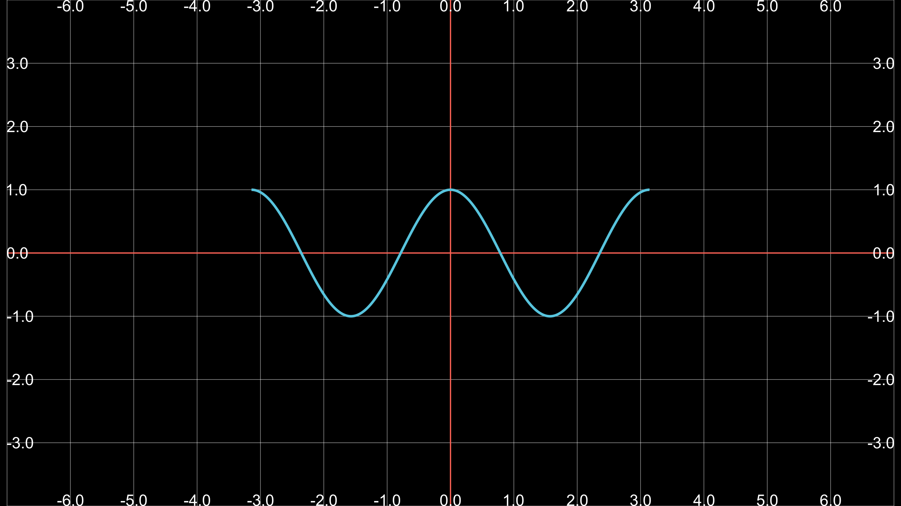

#### `FunctionGraph`类

`FunctionGraph`类是`ParametricFunction`的子类，相当于仅在二维上的函数曲线。

##### 配置

```python
CONFIG = {
        "color": YELLOW,	# 默认曲线颜色
    	# 默认横坐标范围为整个画面长度
        "x_min": -FRAME_X_RADIUS,	
        "x_max": FRAME_X_RADIUS,
    }
```

##### 举例

```python
class Demo(Scene):
    CONFIG = {
        "right_graph_config":{
            "x_min":0.01,
            # "x_max":3,
            "color":BLUE
        },
        "left_graph_config": {
            # "x_min": -3,
            "x_max": -0.01,
            "color": BLUE
        }

    }
    def construct(self):
        screen_grid = ScreenGrid()
        left_graph = FunctionGraph(
            lambda t: 3/5*np.sin(5*t)/(t),
            **self.left_graph_config
        )
        right_graph = FunctionGraph(
            lambda t: 3/5*np.sin(5*t)/(t),
            ** self.right_graph_config
        )
        self.add(screen_grid,left_graph,right_graph)
```

输出结果：

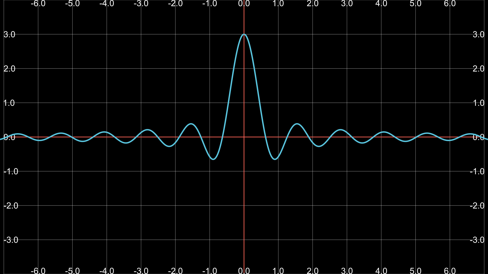

### 部分相关函数

这里再补充一下`graphScene`类的一些函数。

* `setup_axes(self, animate=False)`

> 功能

建立坐标轴。

> parameters

`animate`: `True`表示显示生成坐标轴动画，`False`则表示不显示，直接出现画好的坐标轴。

* `coords_to_point(self, x, y)`

> 功能

根据坐标获取图像中的点。

> parameters

`x`：横坐标。

`y`：纵坐标


* `point_to_coords(self, point)`

> 功能

在图像上返回一个点的坐标

> parameters

`point`：函数图像上某一点。

> return

`[x,y]`


* `input_to_graph_point(self, x, graph)`

> 功能

根据横坐标获取图像上的一个点。

> parameters

`x`：横坐标值

`graph`：生成的函数图像

> return

`point`


* `angle_of_tangent(self, x, graph, dx=0.01)`

> 功能

返回横坐标对应点的斜率的角度。

> parameters

`x`：横坐标值。

`graph`：函数图像。

`dx=0.01`：计算斜率肯定需要两个点，这是两个点的横坐标间隔，默认为0.01。


* `slope_of_tangent(self, *args, **kwargs)`

> 功能

返回一个点的斜率

> parameters

跟`angle_of_tangent`传一样的参数即可。


* `get_derivative_graph(self, graph, dx=0.01, **kwargs)`

> 功能

获取一个函数的微分图像，比如`y=x**2`，那么它的导函数就是`y=2*x`，画出这个导函数的图像。

> parameters

`graph`：已经生成的graph。

`dx`：微小量。


* `get_graph_label(self,graph,label="f(x)",x_val=None,direction=RIGHT,buff=MED_SMALL_BUFF,color=None)`

> 功能

返回函数图像添加`label`，默认是`f(x)`。

> parameters

`graph`：已经生成的函数图像。

`label`：函数标签，默认是`f(x)`。

`x_val`：添加`label`的横坐标。

`direction`：方向。

`buff`：距离。

`color`：标签的颜色。


* `get_riemann_rectangles(self,graph,x_min=None,x_max=None,dx=0.1,input_sample_type="left",stroke_width=1,stroke_color=BLACK,fill_opacity=1,start_color=None,end_color=None,show_signed_area=True,width_scale_factor)`

> 功能

返回函数图像黎曼积分的矩形，就是面积积分的矩形。

> parameters

`graph`：生成的函数图像。

`x_min`：显示矩形的开始位置。

`x_max`：显示矩形的结束位置。

`dx`：其实就是矩形的宽度，当宽度越小时，积分越能近似函数图像的面积积分。

`input_sample_type`：取样点，有`left`、`center`、`right`三个值，应该是求矩形高的时候有关，因为三个值对应的函数值不同，代表的矩形高也不同。

`stroke_width`：矩形边的线宽。

`stroke_color`：矩形线的颜色。

`fill_opacity`：矩形填充的透明度。

`start_color`：填充颜色的起始颜色，涉及到颜色渐变。

`end_color`：填充颜色的结束颜色。

`show_signed_area`：跟积分正负有关，`True`，区分显示负积分的矩形，`False`，不区分显示负积分的矩形。

`width_scale_factor`：还不知道用处是啥，可能自己暂时用不上。

* `get_area(self, graph, t_min, t_max)`

> 功能

求面积积分。相当于前面的`get_riemann_rectangles()`当`dx`很小的情况。

> parameters

`graph`：已经生成的函数图像。

`t_min`：面积积分横坐标开始位置。

`t_max`：面积积分横坐标结束位置。

* `transform_between_riemann_rects(self, curr_rects, new_rects, **kwargs)`

> 功能

将两个`get_riemann_rectangles`矩形`transform`变换。

> parameters

`curr_rects`：旧的矩形。

`new_rects`：新的矩形。

* `get_vertical_line_to_graph(self,x,graph,line_class,**line_kwargs)`

> 功能

获取某个横坐标对应的竖直的线。

> parameters

`x`：横坐标。

`graph`：已经画好的函数图像。

`line_class`：直线线类型，有`Line`（实线）、`Dashline`（虚线）。

`line_kwargs`：其他一些直线的参数。

* `get_vertical_lines_to_graph(self,graph,x_min=None,x_max=None,num_lines=20,**kwargs)`

> 功能

返回`(x_min,x_max)`内的所有竖直线`(VGroup)`，竖直线默认数量为20。

> parameters

`graph`：函数图像。

`x_min`：横坐标最小值。

`x_max`：横坐标最大值。

`num_lines`：竖直线数量。

* `get_secant_slope_group(x,graph,dx=None,dx_line_color=None,df_line_color=None,dx_label=None,df_label=None,include_secant_line=True,secant_line_color=None,secant_line_length=10)`

> 功能

返回一条割线，感觉很有用。

> parameters

`x`：一个点的横坐标。

`graph`：函数图像。

`dx`：画割线肯定要两个点，横坐标`x`确定第一个点，`x+dx`确定另一个点。

`dx_line_color`：线的颜色，具体看图。

`df_line_color`：线的颜色，具体看图。

`dx_label`：具体看图。

`df_label`：具体看图。

`include_secant_line`：True表示显示割线，反之不显示。

`secant_line_color`：割线的颜色。

`secant_line_length`：割线的长度，默认长10。

```python
class MyGraph(GraphScene):
    CONFIG = {
        "x_min": -1,
        "x_max": 10,
        "x_axis_width": 9,
        "x_tick_frequency": 1,
        "x_leftmost_tick": 2,  # Change if different from x_min
        "x_labeled_nums": range(-1,11),
        "x_axis_label": "$x$",
        "y_min": -1,
        "y_max": 10,
        "y_axis_height": 6,
        "y_tick_frequency": 1,
        "y_bottom_tick": None,  # Change if different from y_min
        "y_labeled_nums": range(-1,11),
        "y_axis_label": "$y$",
        "axes_color": GREY,
        "graph_origin": 2.5 * DOWN + 4 * LEFT,
        "exclude_zero_label": True,
        "default_graph_colors": [BLUE, GREEN, YELLOW],
        "default_derivative_color": GREEN,
        "default_input_color": YELLOW,
        "default_riemann_start_color": BLUE,
        "default_riemann_end_color": GREEN,
        "area_opacity": 0.8,
        "num_rects": 50,

    }
    def construct(self):
        self.setup_axes(animate=True)
        p1 = Dot().move_to(self.coords_to_point(1, 1))
        p2 = Dot().move_to(self.coords_to_point(3, 9))
        self.add(p1, p2)
        graph1 = self.get_graph(
            lambda x:x**2,
            x_min=-1,
            x_max=4,
            color=BLUE,
        )
        self.play(ShowCreation(graph1))
        self.wait()
        slope_mob = self.get_secant_slope_group(
            x=1,
            graph=graph1,
            dx=2,
            dx_line_color=YELLOW,
            df_line_color=RED,
            dx_label="dx",
            df_label="dy",
            secant_line_color=PINK

        )

        self.play(ShowCreation(slope_mob))
        self.wait()
```

输出结果：

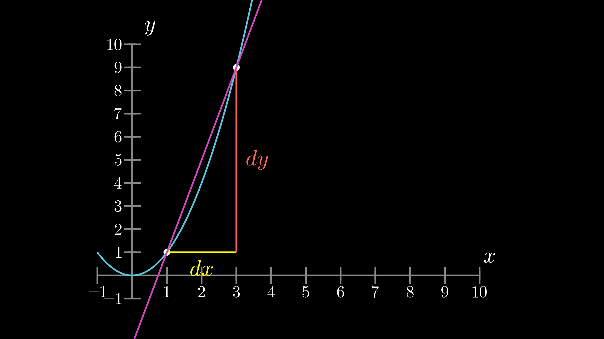

* `animate_secant_slope_group_change()`

> 功能

`update`割线效果。

> parameters

`secant_slope_group`：前面`get_secant_slope_group`生成的割线和`label`，是一个`group`。

`target_dx`：最终`dx`。

`target_x`：最终的`x`。

`run_time=3`：运动时长。

`added_anims`：搞不懂。

`**anim_kwargs`：其他一些关键字参数。

[回到目录](#目录)

---

## 文字类

对于文字操作，我们更多的时候，是考虑文字对齐、上色美化问题。

#### 文字上色

1. **`TexMobject`:  分开字符，分别上色**

```python
class MyFormula(Scene):
    def construct(self):
        tex = TexMobject("\\lim_",             # 0
                          "{h",                 # 1
                          "\\rightarrow","0}",  # 2
                          "{f",                 # 3
                          "\\left(",            # 4
                          "x",                  # 5
                          "+",                  # 6
                          "h",                  # 7
                          "\\right)",           # 8
                          "-",                  # 9
                          "f",                  # 10
                          "\\left(",            # 11
                          "h",                  # 12
                          "\\right)",           # 13
                          "\\over",             # 14
                          "h}"                  # 15
        ).scale(0.7)
        text[0].set_color(RED)
        text[1].set_color(BLUE)
        text[2].set_color(GREEN)
        text[3].set_color(YELLOW)
        text[4].set_color(PINK)
        text[5].set_color(ORANGE)
        text[6].set_color(PURPLE)
        text[7].set_color(MAROON)
        text[8].set_color(TEAL)
        text[9].set_color(GOLD)
        text[10].set_color(GRAY)
        text[11].set_color("#F8C471")
        text[12].set_color("#D0D3D4")
        text[13].set_color("#512E5F")
        text[14].set_color("#273746")
        text[15].set_color("#E6B0AA")
        text[16].set_color("#2ECC71")
        self.play(Write(text))
        self.wait(2)
```

输出结果：

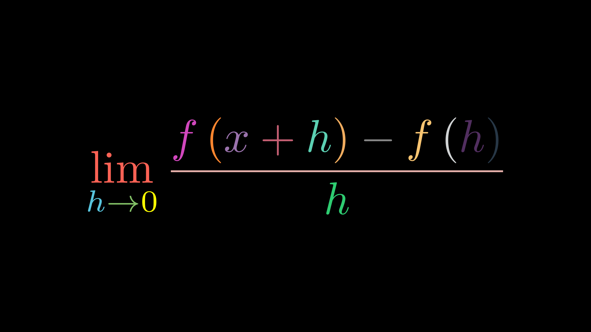

这里对于有分数的上色推荐使用`\\over`而不是用`\\frac{}{}`，后者可能会出现意想不到的问题。

这里可以进一步优化（**推荐**）：

```python
class MyFormula(Scene):
    def construct(self):
        tex = TexMobject("\\lim_",              # 0
                          "{h",                 # 1
                          "\\rightarrow",		# 2
                          "0}",  				# 3
                          "{f",                 # 4
                          "\\left(",            # 5
                          "x",                  # 6
                          "+",                  # 7
                          "h",                  # 8
                          "\\right)",           # 9
                          "-",                  # 10
                          "f",                  # 11
                          "\\left(",            # 12
                          "h",                  # 13
                          "\\right)",           # 14
                          "\\over",             # 15
                          "h}"                  # 16
        ).scale(1.2)
        # 这里设置color_data非常灵活，不必拘泥于此
        color_data = [
            RED,
            BLUE,
            GREEN,
            YELLOW,
            PINK,
            ORANGE,
            PURPLE,
            MAROON,
            TEAL,
            GOLD,
            GRAY,
            "#F8C471",
            "#D0D3D4",
            "#512E5F",
            "#273746",
            "#E6B0AA",
            "#2ECC71"
        ]
        for i,color in zip(range(17),color_data):
            tex[i].set_color(color)
        self.play(Write(tex))
        self.wait(2)
```

输出结果：

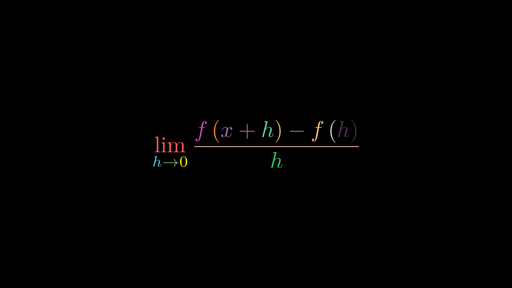

2. **`TexMobject`：使用`set_color_by_tex_to_color_map(t2c)`函数**

```python
class MyFormula(Scene):
    CONFIG = {
        "t2c":{
            "\\lim_":RED,
            "{h":BLUE,
            "\\rightarrow":GREEN,
            "0}":YELLOW,
            "{f":PINK,
            "\\left(":ORANGE,
            "x":PURPLE,
             "+":MAROON,
             "h":TEAL,
             "\\right)":GOLD,
             "-":GRAY,
             "f":"#F8C471",
             "\\left(":"#D0D3D4",
             "h":"#512E5F",
             "\\right)":"#273746",
             "\\over":"#E6B0AA",
             "h}":"#2ECC71"

    }
    }
    def construct(self):
        tex = TexMobject("\\lim_",              # 0
                          "{h",                 # 1
                          "\\rightarrow",       # 2
                          "0}",                 # 3
                          "{f",                 # 4
                          "\\left(",            # 5
                          "x",                  # 6
                          "+",                  # 7
                          "h",                  # 8
                          "\\right)",           # 9
                          "-",                  # 10
                          "f",                  # 11
                          "\\left(",            # 12
                          "h",                  # 13
                          "\\right)",           # 14
                          "\\over",             # 15
                          "h}"                  # 16
        ).scale(1.2)
        tex.set_color_by_tex_to_color_map(self.t2c)
        self.add(tex)
```

输出结果：

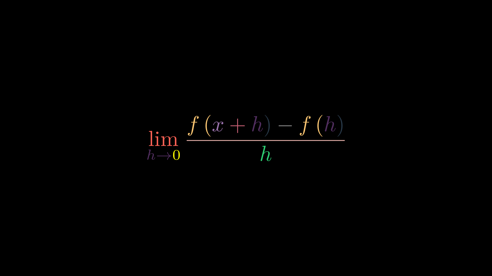

显而易见，使用`t2c`字典，使相同字符有一样的颜色，有优势也有弊端。

这里为什么没提到`TextMobject`呢？主要是`TextMobject`有中文的时候我非常讨厌上色，拆分很烦，就不想那么复杂，反正上色的话跟上面提到的差不多，而且还不如用`Text`。

3. **`Text`:  使用set_color_by_t2c(t2c)函数**

`Text`类是用来显示不同中文字体的类，个人非常喜欢，如果你的版本里的`Text`有`bug`的话，可以去`manim`的`GitHub`上看别人提交的`Pull requests`，有修复`Text`的方法。

```python
class Demo(Scene):
    CONFIG = {
        't2c':{
            'a': RED,
            'b': YELLOW,
            'c': GREEN,
            '你': PURPLE,
            '好': MAROON,
            ',': TEAL
        }
    }
    def construct(self):
        text = Text("abc,你好",font="思源黑体")
        text.set_color_by_t2c(self.t2c)
        self.add(text)
```

输出结果：

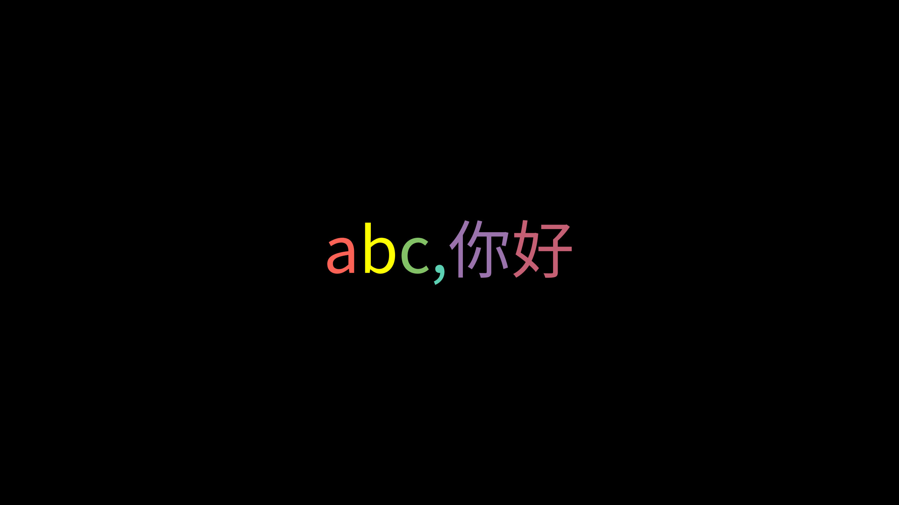

对中文也这样，太棒了！！！

#### 字体对齐  

1. **next_to()**

```python
class Demo(Scene):
    def construct(self):
        tex1 = TexMobject("a").scale(0.8)
        tex2 = TexMobject("ab").scale(0.8)
        tex3 = TexMobject("abc").scale(0.8)
        tex4 = TexMobject("abcd").scale(0.8)
        tex5 = TexMobject("abcde").scale(0.8)
        tex6 = TexMobject("abcdef").scale(0.8)
        # 改变aligned_edge左对齐
        tex1.shift(2*UP)
        tex2.next_to(tex1,direction=DOWN,buff=0.3,aligned_edge=LEFT)
        tex3.next_to(tex2, direction=DOWN, buff=0.3, aligned_edge=LEFT)
        tex4.next_to(tex3, direction=DOWN, buff=0.3, aligned_edge=LEFT)
        tex5.next_to(tex4, direction=DOWN, buff=0.3, aligned_edge=LEFT)
        tex6.next_to(tex5, direction=DOWN, buff=0.3, aligned_edge=LEFT)
        self.add(tex1,tex2,tex3,tex4,tex5,tex6)
```

输出结果：

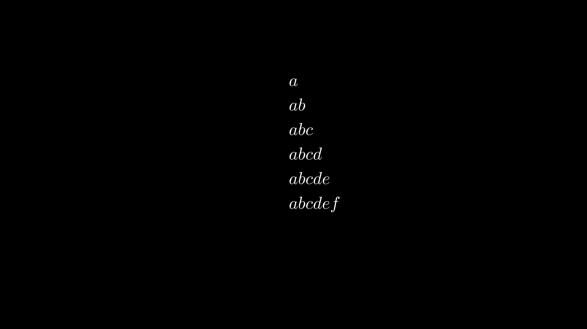

默认的情况下是中间对齐，如：上面代码不添加`aligned_edge=LEFT`，则效果如下：

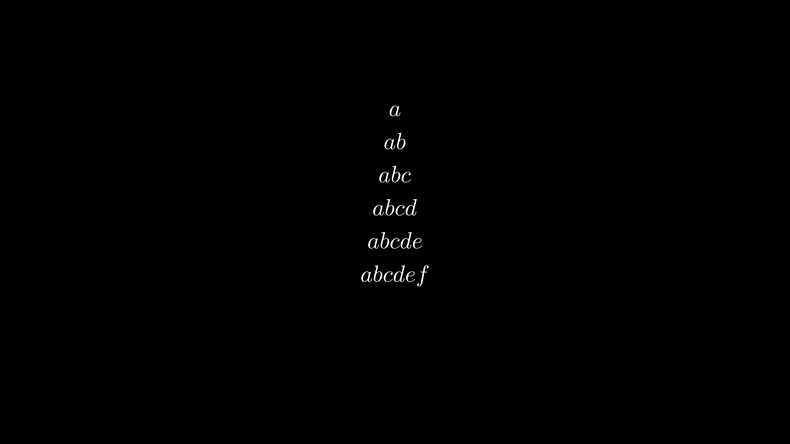

2. **arrange()**

使用`VGroup()`的`arrange()`函数，这个函数的本质是`next_to()`。非常方便，个人推荐。

```python
class Demo(Scene):
    def construct(self):
        tex = [
            "a",
            "ab",
            "abc",
            "abcd",
            "abcde",
            "abcdef"
        ]
        tex_mob = VGroup(
            *[TexMobject(mob).scale(0.8) for mob in tex]
        )
        tex_mob.arrange(
            direction=DOWN,		# next_to()	的direction形参
            aligned_edge=LEFT,	# 左对齐
            buff=0.3
        )
        self.add(tex_mob)
```

输出结果：

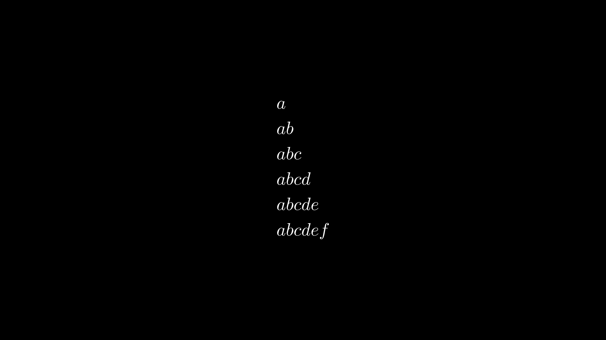

还可以有第三种方法，那就是`latex`语法对齐，但我还没系统的学`latex`，所以就不写了，也少用。

[回到目录](#目录)

---

## `updater`

### 一般用法

```python
class AddUpdater1(Scene):
    def construct(self):
        dot = Dot()
        text = TextMobject("Label")\
               .next_to(dot,RIGHT,buff=SMALL_BUFF)

        self.add(dot,text)

        # Update function
        def update_text(obj):
            obj.next_to(dot,RIGHT,buff=SMALL_BUFF)

        # Add update function to the objects
        text.add_updater(update_text)

        # Add the object again
        self.add(text)

        self.play(dot.shift,UP*2)

        # Remove update function
        text.remove_updater(update_text)

        self.wait()
```

输出结果：


使用` text.add_updater(update_text)`将`label`与点绑定在一起，一起运动。

### `dt`参数

```python
class UpdateDemo1(GraphScene):
    CONFIG = {
        "t_offset": -3,
        "x_max": 3,
        "x_min": -3,
        "y_min": -9,
        "y_max": 9,
        "x_tick_frequency": 1,
        "y_tick_frequency": 1,
        "axes_color": "BLUE",
        "graph_origin": ORIGIN

    }
    def construct(self):

        # 创建一个坐标系
        self.setup_axes(animate=False)
        graph = self.get_graph(self.func, x_min=-3, x_max=3, color=RED)
        self.play(ShowCreation(graph))
        self.wait()
        # 创建一个点，点在图像上移动
        dot = Dot().move_to(self.coords_to_point(-3, self.func(-3)))
        self.add(dot)
        self.wait()
        def update_dot(mob, dt):
            # dt就是帧速率，一帧等于多少秒
            rate = 0.5*dt	# 设置速度
            mob.move_to(self.coords_to_point(self.t_offset +
                                             rate, self.func(self.t_offset+rate)))
            # self.t_offset是起始值
            self.t_offset += rate
        dot.add_updater(update_dot)

        # 创建两条虚线,随着dot移动
        line1 = DashedLine(start=self.coords_to_point(-3, 0),
                           end=self.coords_to_point(-3, self.func(-3)))
        line2 = DashedLine(start=self.coords_to_point(-3, self.func(-3)),
                           end=self.coords_to_point(0, self.func(-3)))
        self.add(line1, line2)

        def update_line1(mob):
            l = DashedLine(
                start=self.coords_to_point(self.t_offset, 0), 											end=self.coords_to_point(
                self.t_offset, self.func(self.t_offset))
            )
            mob.become(l)

        def update_line2(mob):
            l = DashedLine(
                start=self.coords_to_point(self.t_offset, self.func(
                self.t_offset)), 
                end=self.coords_to_point(0, self.func(self.t_offset)))
            mob.become(l)
        line1.add_updater(update_line1)
        line2.add_updater(update_line2)
		# 一定要加下面这句
        self.add(dot, line1, line2)
        self.wait(12)	# 这里控制运动时间
        dot.remove_updater(update_dot)
        # 去掉关联
        line1.remove_updater(update_line1)
        line2.remove_updater(update_line2)

    def func(self, x):
        return x**2
```


按照我的理解就是：点是父级，两条虚线是子集，点的坐标通过`dt`参数实现每前进一帧时改变它的坐标，从而达到运动效果，两条虚线通过`become()`函数实现不断的刷新，与点的位置相关联。

### `ValueTracker`

我的理解就是一个跟踪者，时刻记录某个值得变化，并将这种变化反映到某个物体上。

```python
class Wheel(MovingCameraScene,GraphScene):
    def construct(self):
        self.camera.frame.move_to(2 * RIGHT)
        r = 1
        o = Dot(radius=0.07,color=GREEN).shift(UP)
        p = Dot(radius=0.07,color=RED)
        q = p.deepcopy()
        w = p.deepcopy()
        c = Circle(arc_center=o.get_center(),radius=r,color=BLUE)
        arrow = Arrow(o.get_center(),p.get_center(),buff=0,color=YELLOW)
        l = Line(p,w,color="#99CC33")
        theta = ValueTracker(0)
        def get_o(theta):
            return (theta*r*RIGHT+UP)
        o.add_updater(
            lambda o:o.move_to(get_o(theta.get_value()))
        )
        c.add_updater(
            lambda c:c.move_to(o.get_center())
        )
        def get_p(theta):
            return (RIGHT*r*(theta-np.sin(theta))+UP*r*(1-np.cos(theta)))
        p.add_updater(
            lambda p:p.move_to(get_p(theta.get_value()))
        )
        def get_w(theta):
            return (theta * r * RIGHT)
        w.add_updater(
            lambda d:d.move_to(get_w(theta.get_value()))
        )
        arrow.add_updater(
            lambda mob:mob.become(
                Arrow(
                    o.get_center(),
                    p.get_center(),
                    buff=0,
                    color=YELLOW
                )
            )
        )
        l.add_updater(
            lambda l:l.become(
                Line(q.get_center(),w.get_center(),color="#99CC33")
            )
        )
        self.add(o,p,c,arrow,l,q,w)
        self.wait()
        self.play(
            theta.increment_value,2*PI,
            run_time=8
        )
```

输出结果：


[回到目录](#目录)

---

## `Camera`类

### 配置

```python
CONFIG = {
        "background_image": None,	# 图片背景，可以用绝对路径
        "pixel_height": DEFAULT_PIXEL_HEIGHT,	# 像素高度，默认1440
        "pixel_width": DEFAULT_PIXEL_WIDTH,		# 像素宽度，默认2560
        "frame_rate": DEFAULT_FRAME_RATE,		# 帧速率
        # Note: frame height and width will be resized to match
        # the pixel aspect ratio
        "frame_height": FRAME_HEIGHT,	# 画面高度
        "frame_width": FRAME_WIDTH,		# 画面宽度
        "frame_center": ORIGIN,			# 镜头焦点
        "background_color": BLACK,		# 背景颜色
        "background_opacity": 1,		# 背景不透明度
        # Points in vectorized mobjects with norm greater
        # than this value will be rescaled.
        "max_allowable_norm": FRAME_WIDTH,
        "image_mode": "RGBA",
        "n_channels": 4,
        "pixel_array_dtype": 'uint8',
        # z_buff_func is only used if the flag above is set to True.
        # round z coordinate to nearest hundredth when comparring
        "z_buff_func": lambda m: np.round(m.get_center()[2], 2),
        "cairo_line_width_multiple": 0.01,
        "open_plot_depth":True,
    }
```

在`CONFIG`中配置摄像头:

```python
class CameraTest(Scene):
    CONFIG = {
        "camera_config":{
            "background_image":r"C:\Users\MuxiLi\Pictures\Saved Pictures\阳菜 (2).jpg"
        }
    }
    def construct(self):
        tex = TexMobject("hello")
        self.add(tex)
```

输出结果：其他的属性也可以这样配置。


### 部分相关函数

* `reset_pixel_shape(self, new_height, new_width)`

> 功能

重新设置一个像素的大小。

> parameters

`new_height`：新设置的像素高度。

`new_width`：新设置的像素的宽度。

* `get_pixel_height(self)`

> 功能

获取当前场景像素的高度。

* `get_pixel_width(self)`

> 功能

获取当前场景像素的宽度。

* `get_frame_height(self)`

> 功能

获取当前画面高度。

* `get_frame_width(self)`

> 功能

获取当前画面的宽度。

* `get_frame_center(self)`

> 功能

获取当前镜头的焦点。

* `set_frame_height(self, frame_height)`

> 功能

设置画面的高度。

> parameters

`frame_height`：画面高度。

* `set_frame_width(self, frame_width)`

> 功能

设置画面的宽度。

> parameters

`frame_width`：画面宽度。

* `set_frame_center(self, frame_center)`

> 功能

设置镜头焦点。

> parameters

`frame_center`：镜头焦点坐标。

* `is_in_frame(self, mobject)`

> 功能

判断物体`mobject`是否在画面中。

~~算了，后面的函数看不懂。~~

[返回目录](#目录)

---

## `MovingCameraScene`类

### 放大镜头

这里其实是调用`Camera`类的子类`MovingCamera`类。如果这里详细了解`manim`类的结构，会比较清晰的理解。

```python
class CameraTest(MovingCameraScene):
    def construct(self):
        tex = TexMobject("hello")
        self.play(Write(tex))
        self.wait()
        self.play(
            self.camera.frame.scale,0.5,
            run_time=2
        )
```

输出结果：


可以实现将一些细节放大的效果。

### 移动镜头

```python
class CameraTest(MovingCameraScene):
    def construct(self):
        h = TexMobject("hello").scale(1.3)
        w = TexMobject("word").scale(1.3)\
                              .shift(8*RIGHT)
        self.play(Write(h))
        self.wait()
        self.camera.frame.save_state()	# 存储镜头原始焦点
        self.play(
            self.camera.frame.shift,8*RIGHT,
            run_time=2
        )
        self.play(Write(w))
        self.wait()
        self.play(Restore(self.camera.frame))	# 初始化镜头焦点
```

输出结果：~~world打错了~~


[返回目录](#目录)

---

## `ZoomedScene`类

怎么理解`ZoomedScene`中的摄像头？

结合实际理解，我们拿摄像机拍摄，要展示给别人看，可以通过投屏到荧幕上。同理，在`ZoomedScene`中是一个画面，摄像头`zoomed_camera`拍摄到画面中的某个部分，然后通过“荧幕”`zoomed_display`展示出来。那么接下来就是对`zoomed_camera`和`zoomed_display`两个部分的设置。

### 配置

```python
CONFIG = {
        "camera_class": MultiCamera,# 摄像头类型
        "zoomed_display_height": 3,	# 荧幕高度
        "zoomed_display_width": 3,	# 荧幕宽度
        "zoomed_display_center": None,	# 荧幕位置
        "zoomed_display_corner": UP + RIGHT,	
        "zoomed_display_corner_buff": DEFAULT_MOBJECT_TO_EDGE_BUFFER,	# 距离边界的距离
        "zoomed_camera_config": {
            "default_frame_stroke_width": 2,# 矩形镜头区域的线宽
            "background_opacity": 1,	# 影响的是荧幕的透明度，莫名其妙
        },
    	# ImageMobjectFromCamera类的配置,默认就好了
        "zoomed_camera_image_mobject_config": {},
    	# 默认镜头焦点位置
        "zoomed_camera_frame_starting_position": ORIGIN,
        "zoom_factor": 0.15,
        "image_frame_stroke_width": 3,	# 荧幕线宽
        "zoom_activated": False,	# True表示显示展示区域出现的动画效果
    }
```

**强调：**

* `zoomed_display_center`和`zoomed_display_corner`控制荧幕的位置。如果`zoomed_display_center`有设置，荧幕去往设定位置，如果`zoomed_display_center`不设置，荧幕在角落那里。

```python
if self.zoomed_display_center is not None:
    zoomed_display.move_to(self.zoomed_display_center)
else:
    zoomed_display.to_corner(
     	self.zoomed_display_corner,
        buff=self.zoomed_display_corner_buff
    )
```

* `zoom_factor`为缩放因子（假设设置为0.3），比如荧幕展示区域为3* 3，那么镜头矩形区域为0.9* 0.9，这不是按面积放大来算的。

* 要控制荧幕矩形区域的线宽，`image_frame_stroke_width`好像没有用，因为整个类没有调用它的地方，估计是3b1b忘了把这个参数传进函数中了，不过可以通过`zoomed_camera_image_mobject_config`中设置线宽，然后巴拉巴拉的，我修改了一点点源代码实现了控制荧幕的线宽的效果，无非就是传参接参的问题。~~不过为什么那么麻烦呢，摄像机和荧幕的默认3的线宽不好吗？~~

### 局部放大镜头

```python
class CameraTest(ZoomedScene):
    CONFIG = {
        "zoom_factor": 0.3,
        "zoomed_display_height": 3,
        "zoomed_display_width": 3,

    }
    def construct(self):
        dot = Dot()
        # ScreenGrid生成视频中的网格，跟本次内容无关，只是方便查看镜头和荧幕区域的尺寸
        screen_grid = ScreenGrid()
        self.add(dot,screen_grid)
        # 摄像机
        zoomed_camera = self.zoomed_camera
        # 荧幕
        zoomed_display = self.zoomed_display
        frame = zoomed_camera.frame
        zoomed_display_frame = zoomed_display.display_frame
        frame.move_to(dot)
        frame.set_color(PURPLE)
        self.play(
            ShowCreation(frame)
        )
        # 这句一定要加，相当于投屏的开关
        self.activate_zooming(animate=False)
        self.play(
            self.get_zoomed_display_pop_out_animation()
        )
        self.wait()
```

输出结果：

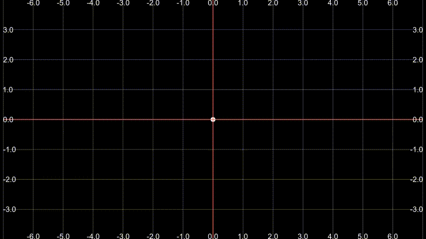

### 跟踪镜头

想实现一个三角形在某条函数曲线上移动，然后有个局部放大镜头跟着移动的效果。

```python
class ZoomedCameraMoveAlongPath(ZoomedScene):
    CONFIG = {
        "curve_config":{
            "x_min":-3,
            "x_max":3,
            "color":PURPLE
        },
        "zoomed_display_height":2,
        "zoomed_display_width":2,
        "zoom_factor":0.3,
        "zoomed_display_corner":DR,
        "zoomed_camera_image_mobject_config":{
            "stroke_color":GREEN,
        }
    }
    def get_pending(self,path,proportion,dx=0.01):
        # 获取曲线在某一点的切线的角度
        if proportion < 1:
            coord_i = path.point_from_proportion(proportion)
            coord_f = path.point_from_proportion(proportion+dx)
        else:
            coord_i = path.point_from_proportion(proportion-dx)
            coord_f = path.point_from_proportion(proportion)
        line = Line(coord_i,coord_f)
        angle = line.get_angle()
        return angle
    def construct(self):
        # curve
        curve = FunctionGraph(
            lambda t: np.sin(3*t),
            **self.curve_config
        )
        
        # triangle
        triangle = Triangle().set_height(0.2)
        triangle.move_to(curve.get_start())
        triangle.rotate(- PI / 2)
        triangle.save_state()
        start_angle = self.get_pending(curve,0)
        triangle.rotate(start_angle, about_point=triangle.get_center())
        
        # camera
        zoomed_camera = self.zoomed_camera
        zoomed_display = self.zoomed_display
        zoomed_display_frame = zoomed_display.display_frame
        frame = zoomed_camera.frame
        frame.move_to(triangle)\
             .set_color(YELLOW)
            
        def update_triangle(mob,alpha):
            triangle.restore()
            angle = self.get_pending(curve,alpha)
            triangle.move_to(curve.point_from_proportion(alpha))
            triangle.rotate(angle,about_point=triangle.get_center())
        def update_zoomed_camera(mob):
            mob.move_to(triangle)
        self.add(curve, triangle)
        self.play(ShowCreation(frame))
        self.activate_zooming()
        self.play(
            self.get_zoomed_display_pop_out_animation(),
        )
        self.play(
            UpdateFromAlphaFunc(triangle,update_triangle),
            UpdateFromFunc(frame,update_zoomed_camera),
            run_time=8
        )
```

输出结果：


不知为什么放大镜头对于线的颜色和线宽不能有效体现出来。

### 部分相关函数

* `activate_zooming(self, animate=False)`

> 功能

激活摄像头，荧幕才能接收到画面。

> parameters

`animate`：是否显示动画。个人认为`False`较好。

* `get_zoom_in_animation(self, run_time=2, **kwargs)`

> 功能

获取动画？~~反正我不想用~~

输出结果：


* `get_zoomed_display_pop_out_animation(self, **kwargs)`

> 功能

显示动画的一种效果，详细可看上面局部放大镜头的例子。

* `get_zoom_factor(self)`

> 功能

获取放大倍数。

---

## `MultiScene`类

`MultiScene`类继承`ZoomedScene`类，所以一些配置参数直接看着`ZoomedScene`传就行了。

代码：[MultiScene](./code/MultiSceme)

关于给manim添加自定义类的问题我就不多费口舌了。

这个类是我模仿`ZoomedScene`类写的，太难看了，凑合着用吧。跟`ZoomedScene`的用法差不多。

### 多镜头显示

```python
class MultiSceneDemo(MultiScene):
    def construct(self):
        d1 = Dot().shift(UP)
        d2 = Dot().shift(DOWN)
        self.add(d1,d2)
        # 跟ZoomedScene一样，在外面设置frame，包括位置和颜色
        frame1 = self.zoomed_cameras[0].frame
        frame2 = self.zoomed_cameras[1].frame
        frame1.move_to(d1)\
              .set_color(YELLOW)
        frame2.move_to(d2)\
              .set_color(BLUE)
        self.zoomed_displays[0].to_corner(UR,buff=DEFAULT_MOBJECT_TO_EDGE_BUFFER)
        self.zoomed_displays[1].to_corner(DR,buff=DEFAULT_MOBJECT_TO_EDGE_BUFFER)

        zoomed_display_frmae1 = self.zoomed_displays[0].display_frame
        zoomed_display_frmae2 = self.zoomed_displays[1].display_frame
        zoomed_display_frmae1.set_color(YELLOW)
        zoomed_display_frmae2.set_color(BLUE)
        self.play(
            ShowCreation(frame1),
            ShowCreation(frame2),

        )
        # 激活所有display
        self.activate_zooming()
        self.wait()
        # 获取每个display的applymethod，目的是一起播放，跟ZoomedScene的区别
        apply_methods = self.get_zoomed_display_pop_out_animation()
        self.play(
            *[method for method in apply_methods]
        )
        self.wait()
```

输出结果：

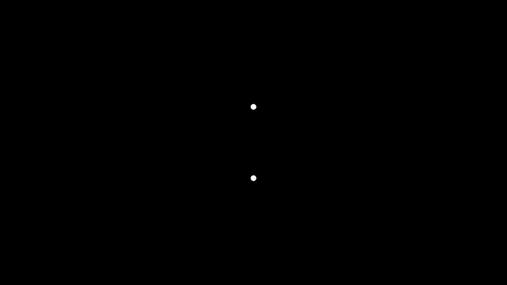

结合上面的跟踪镜头，可以让多个镜头实现跟踪效果。

```python
class ZoomedCameraMoveAlongPath2(MultiScene):
    CONFIG = {
        "curve_config": {
            "t_min": 0,
            "t_max": 6.3,
            "color": PURPLE
        },
        "zoomed_display_height": 3,
        "zoomed_display_width": 3,
        "zoom_factor": 0.2,
    }

    def get_pending(self,path,proportion,dx=0.01):
        if proportion < 1:
            coord_i = path.point_from_proportion(proportion)
            coord_f = path.point_from_proportion(proportion+dx)
        else:
            coord_i = path.point_from_proportion(proportion-dx)
            coord_f = path.point_from_proportion(proportion)
        line = Line(coord_i,coord_f)
        angle = line.get_angle()
        return angle
    def construct(self):
        def function(t):
            a = 1
            b = 0.5
            x = a*np.sin(t)*(np.exp(np.cos(t))-2*np.cos(4*t)+(np.sin(t/12))**5)
            y = b*np.cos(t)*(np.exp(np.cos(t))-2*np.cos(4*t)+(np.sin(t/12))**5)
            return np.array([x,y,0])
        # curve
        curve = ParametricFunction(
            function,
            **self.curve_config
        )
        # triangle
        triangle1 = Triangle().set_height(0.2) \
            .set_color(BLUE)
        triangle2 = Triangle().set_height(0.2) \
            .set_color(YELLOW)
        triangle1.rotate(-PI / 2)
        triangle2.rotate(-PI / 2)
        triangle1.save_state()
        triangle2.save_state()
        start_angle1 = self.get_pending(curve, 0)
        start_angle2 = self.get_pending(curve, 0.5)
        triangle1.move_to(curve.get_start())
        triangle1.move_to(curve.point_from_proportion(1))
        triangle1.rotate(start_angle1, about_point=triangle1.get_center())
        triangle2.rotate(start_angle2, about_point=triangle1.get_center())

        def update_triangle1(mob,alpha):
            mob.restore()
            angle = self.get_pending(curve,alpha)
            mob.move_to(curve.point_from_proportion(alpha))
            mob.rotate(angle,about_point=mob.get_center())
        def update_triangle2(mob,alpha):
            # triangle按反方向移动的
            mob.restore()
            angle = self.get_pending(curve,-alpha+1)+PI
            mob.move_to(curve.point_from_proportion(-alpha+1))
            mob.rotate(angle,about_point=mob.get_center())
        self.add(curve,triangle1,triangle2)

        zoomed_camera1 = self.zoomed_cameras[0]
        zoomed_camera2 = self.zoomed_cameras[1]
        zoomed_camera1.frame.set_color(BLUE)\
                            .move_to(triangle1)
        zoomed_camera2.frame.set_color(YELLOW)\
                            .move_to(triangle2)

        zoomed_display1 = self.zoomed_displays[0]
        zoomed_display1.to_corner(DR)
        zoomed_display2 = self.zoomed_displays[1]
        zoomed_display2.to_corner(DL)

        zoomed_display_frame1 = zoomed_display1.display_frame
        zoomed_display_frame2 = zoomed_display2.display_frame
        zoomed_display_frame1.set_color(BLUE)
        zoomed_display_frame2.set_color(YELLOW)

        def update_zoomed_camera1(mob):
            mob.move_to(triangle1)
        def update_zoomed_camera2(mob):
            mob.move_to(triangle2)

        self.play(
            ShowCreation(zoomed_camera1.frame),
            ShowCreation(zoomed_camera2.frame),
        )
        self.wait()
        self.activate_zooming()
        self.wait()
        apply_methods = self.get_zoomed_display_pop_out_animation()
        self.play(
            *[method for method in apply_methods]
        )
        self.wait()
        self.play(
            UpdateFromAlphaFunc(triangle1, update_triangle1),
            UpdateFromAlphaFunc(triangle2, update_triangle2),
            UpdateFromFunc(zoomed_camera1.frame, update_zoomed_camera1),
            UpdateFromFunc(zoomed_camera2.frame, update_zoomed_camera2),
            run_time=10
        )
```

输出结果：


不过我觉得一般的视频放两个镜头都不错了，而且这个类用起来太麻烦了，需要在外面修改好多东西（矩形颜色和位置）,所以后面考虑在配置参数中直接设置好。:)