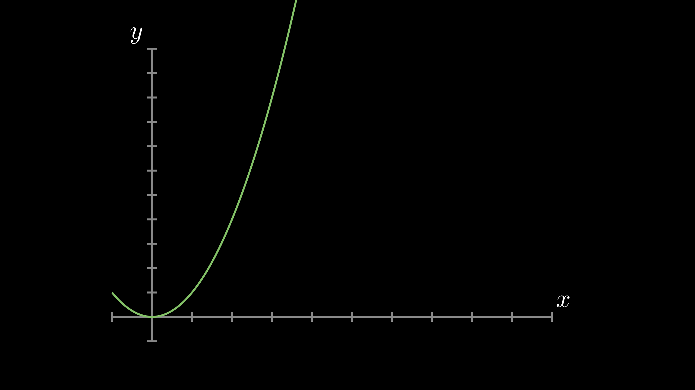
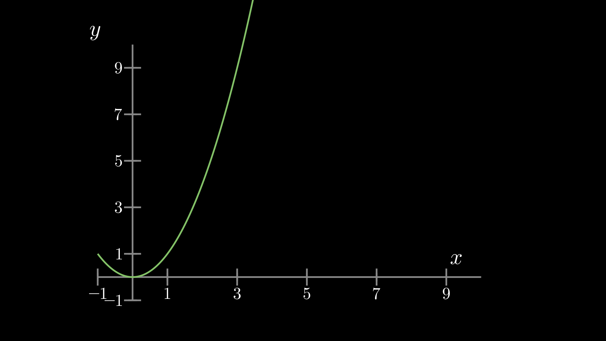
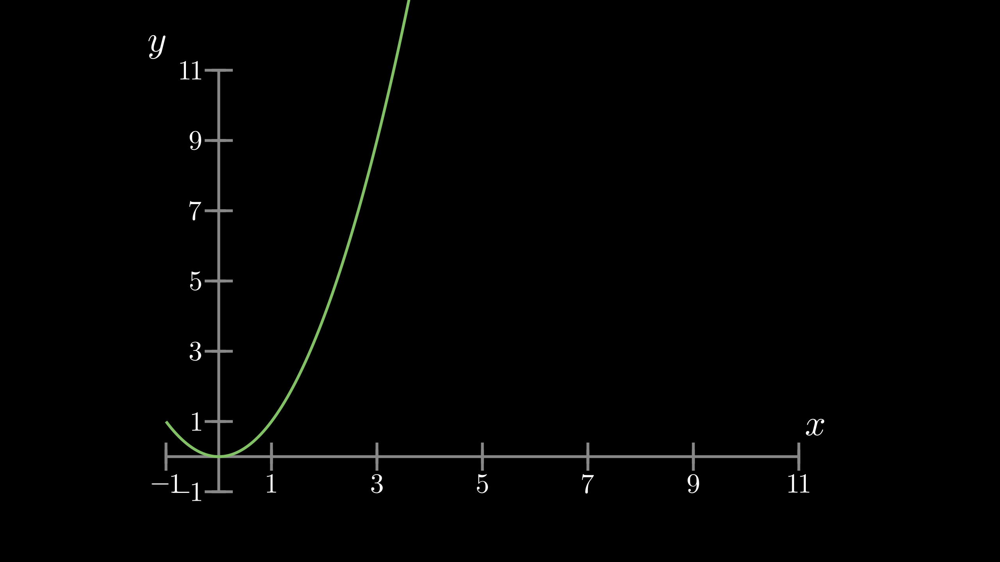
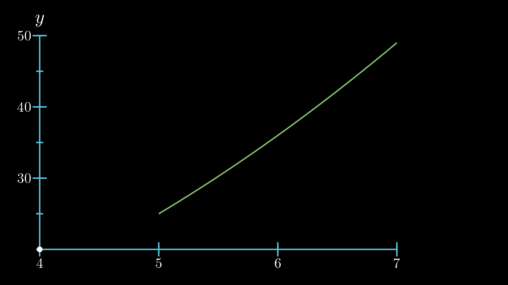
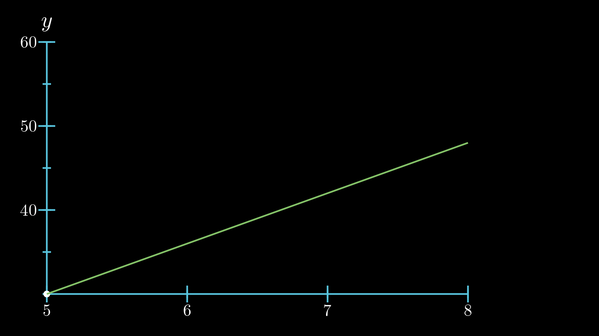
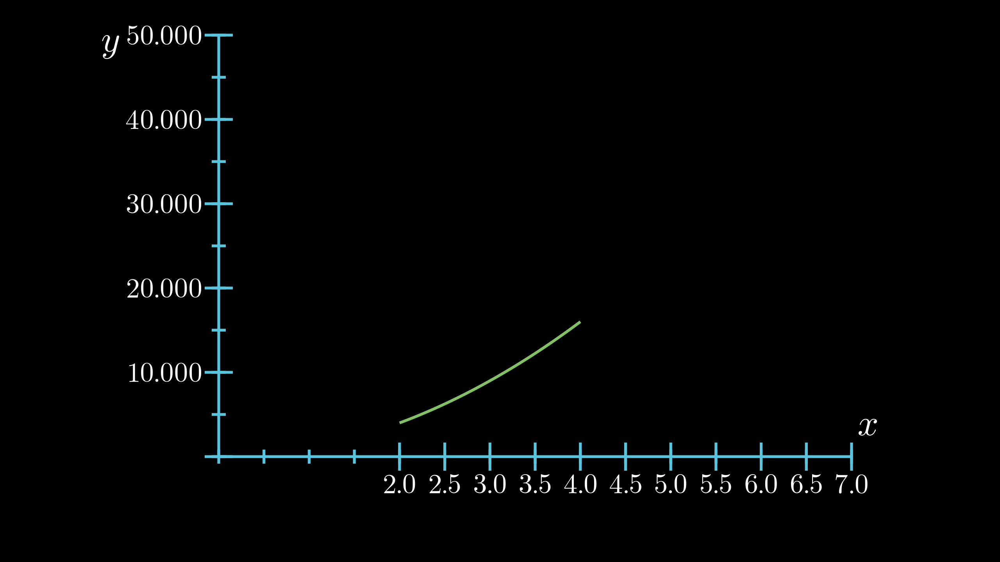
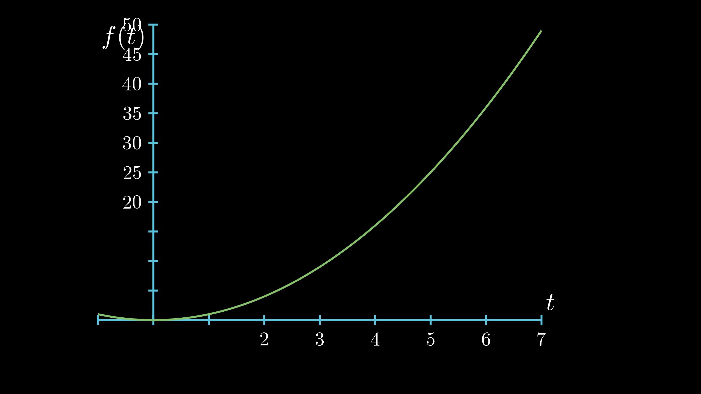
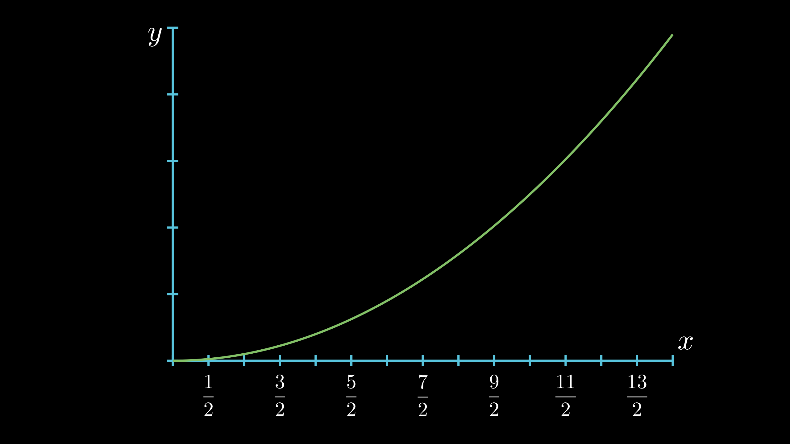
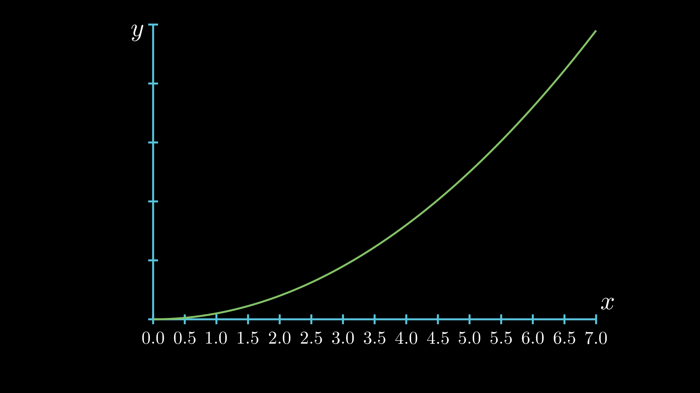

# MyAnimationWithManim

## 写在前面

本着遇到各种坑再寻找解决方法的原则，总结了我遇到了各种坑的解决方法，可能有些方法并不是很好。

## 问题一：坐标系的设置

我们要显示函数图像，首先要设置坐标轴，才能让函数图像在坐标轴上显示出来。

以下是一般的设置方法：（CONFIG里的参数如果默认的话可以不用定义）

```python
class Plot1(GraphScene):
    CONFIG = {
        "x_min": -1,		# 横坐标最小值
        "x_max": 10,		# 横坐标最大值
        "x_axis_width": 9,	# 整个画面的宽度是14，可以设置x轴所占的宽度
        "x_tick_frequency": 1,	  # x轴刻度间隔
        "x_leftmost_tick": None,  # 从最小刻度开始绘制tick，如果不是None，则最小刻度那里没有tick
        # 感觉可以改写源代码，让最小刻度的tick在需要的值开始
        "x_labeled_nums": None,	  # 横坐标刻度值，传入列表
        "x_axis_label": "$x$",	  # 就是横坐标的label，一般是x
        "y_min": -1,			  # 纵坐标的最小值
        "y_max": 10,			  # 纵坐标的最大值
        "y_axis_height": 6,		  # 纵坐标轴所占的画面高度，画面全高为6
        "y_tick_frequency": 1,	  # y轴刻度值间隔
        "y_bottom_tick": None,    # 跟x_leftmost_tick一样
        "y_labeled_nums": None,	  # 是否显示纵坐标数字刻度
        "y_axis_label": "$y$",	  # y轴的label，一般为y
        "axes_color": GREY,		  # 坐标轴的颜色
        "graph_origin": 2.5 * DOWN + 4 * LEFT,			# 原点的位置，注意是绝对坐标
        "exclude_zero_label": True,						# 是否显示原点的label
        "default_graph_colors": [BLUE, GREEN, YELLOW],	# 图像颜色
        "default_derivative_color": GREEN,				# 这是啥？
        "default_input_color": YELLOW,					# 这也是啥？
        "default_riemann_start_color": BLUE,			# 这是啥？
        "default_riemann_end_color": GREEN,				# 黎曼是啥？
        "area_opacity": 0.8,							# 在显示面积积分的时候显示的颜色透明度
        "num_rects": 50,								# 这是啥？
        
    }
    def construct(self):
        self.setup_axes(animate=True)	# 是否显示坐标轴动画
        graph = self.get_graph(lambda x : x**2,  	# 函数表达式，可以另写在def中
                                    color = GREEN,	# 函数图像颜色
                                    x_min = 2, 		# 图像的最小值
                                    x_max = 4		# 图像的最大值
                                    )
        self.play(
        	ShowCreation(graph),
            run_time = 2
        )
        self.wait()
```

输出结果：



以上都是`manim`默认设置的`graph`，但有时我们需要**定制**适合自己的坐标系。这里主要展示我平时制作视频时遇到的问题。

1. **显示坐标轴刻度值，并且间隔为2**

```python
# 只需改改CONFIG中的参数即可
"x_tick_frequency": 2,
"x_labeled_nums": range(-1,11,2),
"y_tick_frequency": 2,
"y_labeled_nums": range(-1,11,2),
```

输出结果：



由于横纵坐标的最大值为10，而间隔为2，所以最终不会显示10的`tick`。

解决方法是：要么改变`x_tick_frequency`和`y_tick_frequency`，要么改变`x_max`和`y_max`使最大值有对应的`tick`。

```python
"x_max":11,
"y_max":11,
"x_tick_frequency": 2,
"x_labeled_nums": range(-1,12,2),
"y_tick_frequency": 2,
"y_labeled_nums": range(-1,12,2),
```

输出结果：



2. **至少其中一个坐标轴的原点不是从0开始的**

视频中的画面是有大小的，有时候我们只需要查看函数图像从某一个值开始的情况，比如x>20的情况，这时候画面可能并不会显示函数图像，就如上面的设置，横坐标到11就差不多到边界了。以前曾天真的scale()坐标系，真是太痛苦了。

```python
class PlotGraph(GraphScene):
    CONFIG = {
        "y_max" : 50,
        "y_min" : 20,
        "x_max" : 7,
        "x_min" : 4,
        "y_tick_frequency" : 5, 
        "x_tick_frequency" : 1,
        "axes_color" : BLUE,
        "y_labeled_nums": range(30,60,10),
        "x_labeled_nums": list(np.arange(4, 8)),
        # "x_label_decimal":1,
        "graph_origin": 3 * DOWN + 6 * LEFT,
        "x_label_direction":DOWN,
        "y_label_direction":RIGHT,
        "x_axis_label": None,
        "x_axis_width":10
    }

    def construct(self):
        self.setup_axes(animate=False) 
        # 移动坐标轴，暂时还想不出为什么会这样移动，得研究源码才知道，先记住然后运用再说
        self.x_axis.shift(LEFT*abs(self.y_axis[0].points[0]-self.x_axis[0].points[0]))
        self.y_axis.shift(DOWN*abs(self.y_axis[0].points[0]-self.x_axis[0].points[0]))
        # 对x、ylabel进行移动，这里可以看出self.x_axis[0]应该是numberline
        self.x_axis_label_mob.next_to(self.x_axis[0].get_end(),UP)
        self.y_axis_label_mob.next_to(self.y_axis[0].get_end(),UP)
        p=Dot().move_to(self.coords_to_point(self.x_min, self.y_min))
        self.add(p)
        graph = self.get_graph(lambda x : x**2, 
                                    color = GREEN,
                                    x_min = 5, 
                                    x_max = 7
                                    )

        self.play(
            ShowCreation(graph),
            run_time = 2
        )
        self.wait()
```

输出结果：**图片的xlabel是正常显示的。**



发现不管怎么设置横纵坐标的起始值，运用这种移动方式都可以满足要求，例如下面：

```python
# 修改上面一些值
"x_min":5,
"x_max":8,
"y_min":30,
"y_max":60,
"x_labeled_nums": list(np.arange(5, 9)),
"y_labeled_nums":range(40,70,10),
graph = self.get_graph(lambda x : 6*x,
                                    color = GREEN,
                                    x_min = 5, 
                                    x_max = 8
                                    )
```

输出结果：



3. **具有小数刻度值的坐标轴**

这里不知道是不是我安装的版本旧还是作者没有更新这个问题，所以我就改了了一下源代码，来满足我的需求。

在改代码之前，我们首先要知道，`graph`在初始化的时候，生成两个坐标轴：`x_axis`、`y_axis`，这两个其实是`Numberline`，然后y轴旋转90度就得到我们看到的坐标系。其中的刻度小数位数可以在`number_line.py`中修改：

```python
CONFIG = {
    # ......
    "decimal_number_config": {
            "num_decimal_places": 0,
        },
    # ......
}
```

可以看到默认的刻度值是0位小数的，我们可以在定义`Numberline`的时候引入一个数，具体的做法如下：

```python
# graph_scene.py
# 在graph_scene.py的CONFIG配置中添加两个变量
"x_label_decimal":0,	# 0是默认是没有小数的
"y_label_decimal":0,
# 在def setup_axes()中作如下修改
x_axis = NumberLine(
            x_min=self.x_min,
            x_max=self.x_max,
            unit_size=self.space_unit_to_x,
            tick_frequency=self.x_tick_frequency,
            leftmost_tick=self.x_leftmost_tick,
            numbers_with_elongated_ticks=self.x_labeled_nums,
            color=self.axes_color,
    		# 添加了下面一行
            decimal_number_config={"num_decimal_places": self.x_label_decimal}
        )
 y_axis = NumberLine(
            x_min=self.y_min,
            x_max=self.y_max,
            unit_size=self.space_unit_to_y,
            tick_frequency=self.y_tick_frequency,
            leftmost_tick=self.y_bottom_tick,
            numbers_with_elongated_ticks=self.y_labeled_nums,
            color=self.axes_color,
            line_to_number_vect=LEFT,
            label_direction=LEFT,
     		# 添加了下面一行
            decimal_number_config={"num_decimal_places": self.y_label_decimal}
        )
```

那我们在写代码的时候是怎样的的呢？

```python
class Plot1(GraphScene):
    CONFIG = {
        "y_max" : 50,
        "y_min" : 0,
        "x_max" : 7,
        "x_min" : 0,
        "y_tick_frequency" : 5, 
        "x_tick_frequency" : 0.5, 
        "axes_color" : BLUE, 
        "y_labeled_nums": range(0,60,10),
        "x_labeled_nums": list(np.arange(2, 7.0+0.5, 0.5)),
        "x_label_decimal":1,	# 这里设置x轴刻度值小数位数
        "y_label_direction": RIGHT,
        "x_label_direction": UP,
        "y_label_decimal":3		# 这里设置y轴刻度值小数位数
    }
    def construct(self):
        self.setup_axes(animate=True)
        graph = self.get_graph(lambda x : x**2,  
                                    color = GREEN,
                                    x_min = 2, 
                                    x_max = 4
                                    )
        self.play(
        	ShowCreation(graph),
            run_time = 2
        )
        self.wait()
```

输出结果：



4. **自定义setup_axes()函数**

   上面有关`graph`的变量赋值都是通过`CONFIG`实现的，但可以自己写一个`setup_axes()`实现这个效果。原则上说，`graph_scene.py`中`CONFIG`中定义的变量都可以在`setup_axes`中实现。

```python
class Plot2(GraphScene):
    CONFIG = {
        "y_max" : 50,
        "y_min" : 0,
        "x_max" : 7,
        # "x_min" : 0,	# 假设注释这个，在自己的setup_axes()中定义
        "y_tick_frequency" : 5,
        "axes_color" : BLUE,
        "x_axis_label" : "$t$",
        "y_axis_label" : "$f(t)$",
    }
    def construct(self):
        self.setup_axes()	# 调用setup_axes()
        graph = self.get_graph(lambda x : x**2, color = GREEN)
        self.play(
        	ShowCreation(graph),
            run_time = 2
        )
        self.wait()

    def setup_axes(self):
        # 一定要加这一句，先初始坐标系，再更改其他的东西
        GraphScene.setup_axes(self) 
        # Parametters of labels
        #   For x
        self.x_min=-1	# 横轴最小值
        self.x_axis.label_direction = DOWN #DOWN is default
        self.y_axis.label_direction = RIGHT
		# 添加坐标轴刻度值
        self.x_axis.add_numbers(*range(
                                        2,
                                        7+1,
                                        1
                                    ))
        self.y_axis.add_numbers(*range(
                                        20,
                                        50+20,
                                        5
                                    ))
        # 显示生成坐标轴的动画
        self.play(
            ShowCreation(self.x_axis),
            ShowCreation(self.y_axis)
        )
```

输出结果：



自定义坐标轴还是挺重要的，因为有时候我们需要在同一个画面中显示两个坐标系，需要定义不同的参数。

5. **自定义刻度值**

前面的刻度值都是整数或者小数，但我们有时候不想要，比如想要分数的刻度值，咋办呢？

```python
class Plot5(GraphScene):
    CONFIG = {
        "y_max" : 50,
        "y_min" : 0,
        "x_max" : 7,
        "x_min" : 0,
        "y_tick_frequency" : 10,
        "x_tick_frequency" : 0.5,
        "axes_color" : BLUE,
    }
    def construct(self):
        self.setup_axes()
        graph = self.get_graph(lambda x : x**2, color = GREEN)

        self.play(
            ShowCreation(graph),
            run_time = 2
        )
        self.wait()

    def setup_axes(self):
        GraphScene.setup_axes(self)
        self.x_axis.label_direction = UP
        values_x = [
            "\\frac{1}{2}",
            "\\frac{3}{2}",
            "\\frac{5}{2}",
            "\\frac{7}{2}",
            "\\frac{9}{2}",
            "\\frac{11}{2}",
            "\\frac{13}{2}",
        ]
        self.x_axis_labels = VGroup()  # Create a group named x_axis_labels
        for x_val,position in zip(values_x,np.arange(0.5,7,1)):
            tex = TexMobject(x_val).scale(0.7)
            tex.next_to(self.coords_to_point(position, 0), DOWN)
            self.x_axis_labels.add(tex)
        self.play(
            Write(self.x_axis_labels),
            Write(self.x_axis),
            Write(self.y_axis)
        )
```

输出结果：



这里也可以自定义刻度值来实现**小数刻度值**的情况。

```python
class Plot7(GraphScene):
    CONFIG = {
        "y_max" : 50,
        "y_min" : 0,
        "x_max" : 7,
        "x_min" : 0,
        "y_tick_frequency" : 10,
        "x_tick_frequency" : 0.5,
        "axes_color" : BLUE,
    }
    def construct(self):
        self.setup_axes()
        graph = self.get_graph(lambda x : x**2, color = GREEN)

        self.play(
            ShowCreation(graph),
            run_time = 2
        )
        self.wait()

    def setup_axes(self):
        GraphScene.setup_axes(self)
        self.x_axis.label_direction = UP
        # Additional parametters
        init_val_x = 0
        step_x = 0.5
        end_val_x = 7
        # Position of labels
        values_decimal_x=Range(init_val_x,end_val_x,step_x)
        # List of labels 注意这里
        list_x=[*["%.1f"%i for i in values_decimal_x]]
        # List touples of (posición,etiqueta)
        values_x = [
            (i,j)
            for i,j in zip(values_decimal_x,list_x)
        ]
        self.x_axis_labels = VGroup()
        for x_val, x_tex in values_x:
            tex = TexMobject(x_tex)
            tex.scale(0.7)
            tex.next_to(self.coords_to_point(x_val, 0), DOWN)
            self.x_axis_labels.add(tex)
        self.play(
            Write(self.x_axis_labels),
            Write(self.x_axis),
            Write(self.y_axis)
        )

```

输出结果：



所以自定制刻度值是非常灵活的，可以实现在坐标轴上只显示几个点的刻度值。

6. **显示多个坐标**

