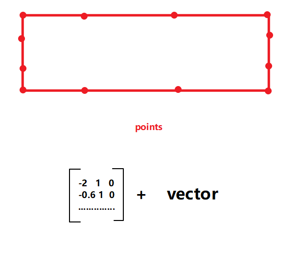
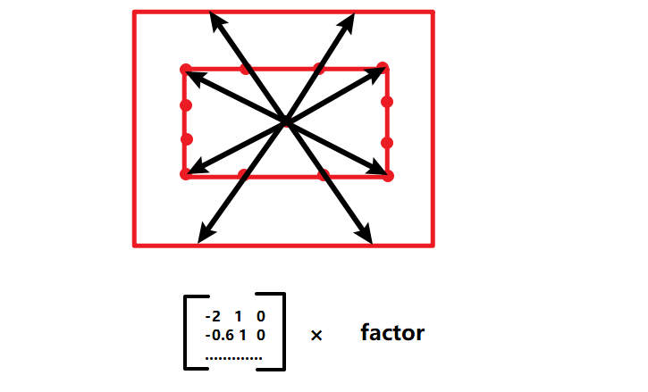

## TODO

- [x] `def reset_points(self)`：介绍`points`属性。
- [x] `def generate_target`：做一个动画。
- [x] `self.submobjects`：有什么作用？
- [ ] `Triangle`在`shift`等变换之后，解决顶点坐标不会更新的问题。
- [x] `add_updater()`：做一个动画。
- [x] `self.apply_points_function_about_point`原理，`self.points`的作用。
- [ ] `rotate`旋转的不同。
- [ ] `self.flip()`的细节。
- [ ] `def apply_matrix()`功能。
- [ ] `def apply_complex_function()`功能。
- [ ] `def wag()`实现细节。
- [ ] `def reverse_points()`功能。
- [ ] `def repeat()`功能。
- [ ] `def shift_onto_screen()`功能。
- [ ] `def next_to()`参数设置。

## 目录

* [前言](#前言)
* [updater](#updater)
  * [一般用法](#一般用法)
  * [包含dt参数](#包含dt参数)
  * [ValueTracker](#ValueTracker)
* [Mobject类](#Mobject类)
  * [CONFIG属性](#CONFIG属性)
  * [相关函数](#相关函数)
* [VMobject类](#VMobject类)


## 前言

`Mobject`是用数学描述的对象，是屏幕中出现的所有物体的基类。

---

## `updater`

### 一般用法

`text`跟着`dot`一起移动，就像给`text`添加了个约束条件。

```python
class AddUpdater1(Scene):
    def construct(self):
        dot = Dot()
        text = TextMobject("Label").next_to(dot,RIGHT,buff=SMALL_BUFF)
        self.add(dot,text)

        # Update function
        def update_text(obj):
            obj.next_to(dot,RIGHT,buff=SMALL_BUFF)
        # Add update function to the objects
        text.add_updater(update_text)	# text就是update_text()的obj参数
        # Add the object again
        self.add(text)
        self.play(dot.shift,UP*2)
        # Remove update function
        text.remove_updater(update_text)
        self.wait()
```

输出结果：


### 包含`dt`参数

```python
class UpdateDemo(Scene):
    def construct(self):
        triangle = Triangle()
        self.rec = Rectangle(height=0.2, width=5, color=YELLOW_C).next_to(triangle, UP, 0.05)
        c = Circle(radius=0.2).next_to(self.rec,UP,0)
        # 把圆加入矩形的子物体，让他们update同时进行
        self.rec.add(c)
        self.P = c.get_center()
        self.O = triangle.get_vertices()[0]
        self.angle = 0
        self.sig = 1    # 1表示上升，-1表示下降
        self.rec.add_updater(self.update_rec)
        c.add_updater(self.update_cir)
        # 这里self.add(rec)就行了
        self.add(self.rec, triangle)
        self.wait(10)

    def update_rec(self, mob, dt):
        sig = self.sig
        angle = self.angle
        if angle >= 30 or angle <= -30:
            sig *= -1
        rate = 20 * sig * dt
        mob.rotate(rate*DEGREES, about_point=self.O)
        self.angle += rate
        self.sig = sig

    def update_cir(self,mob,dt):
        x = 5/3*dt*np.cos(self.angle*PI/180)
        y = 5/3*dt*np.sin(self.angle*PI/180)
        coord = np.array([x,y,0])
        if self.sig == 1:
            mob.move_to(mob.get_center()-coord)
        else:
            mob.move_to(mob.get_center()+coord)
```

输出结果：


```python
from manimlib.imports import *
from tutorial.screen_grid import ScreenGrid
class MetaballsGrid(VGroup):
    CONFIG = {
        "side_length": 0.8,
    }

    def __init__(self, rows, columns, **kwargs):
        digest_config(self, kwargs, locals())
        super().__init__(**kwargs)
        squares = VGroup(
            *[Square(side_length=self.side_length, stroke_width=1) for _ in range(self.rows * self.columns)])
        squares.arrange_in_grid(n_rows=self.rows, n_cols=self.columns, buff=0)
        dots = VGroup(*[Dot(point=squa.get_center(), radius=0.05) for squa in squares])
        self.add(squares, dots)


class MetaballScene(Scene):
    def construct(self):
        mgrid = MetaballsGrid(11, 18)
        self.c1 = Circle(radius=0.5, velocity=(RIGHT * 2 + UP) * 2e-2)
        self.c2 = Circle(radius=0.8, velocity=(LEFT * 2 + UP) * 2e-2)
        self.c3 = Circle(radius=1.0, velocity=(RIGHT * 2 + DOWN) * 2e-2)
        self.c1.add_updater(self.update_circle)
        self.c2.add_updater(self.update_circle)
        self.c3.add_updater(self.update_circle)
        mgrid.add_updater(self.update_mgrid)
        self.add(mgrid, self.c1, self.c2, self.c3)
        self.wait(30)

    def update_circle(self, mob, dt):
        velocity = mob.velocity
        mob.shift(velocity)
        if abs(mob.get_center()[1]) > (FRAME_HEIGHT - mob.get_height()) / 2:
            velocity[1] *= -1
        if abs(mob.get_center()[0]) > (FRAME_WIDTH - mob.get_width()) / 2:
            velocity[0] *= -1
        mob.velocity = velocity

    def update_mgrid(self, mob):
        # squares = mob[0]
        for squa in mob[0]:
            cen = squa.get_center()
            f = self.get_space(cen)
            if f > 1:
                squa.set_fill(RED_C, opacity=1)
            else:
                squa.set_fill(opacity=0)
        # mob[0] = squares

    def get_space(self, cen):
        x_list = [cen[0]] * 3
        y_list = [cen[1]] * 3
        xi_list = [c.get_center()[0] for c in [self.c1, self.c2, self.c3]]
        yi_list = [c.get_center()[1] for c in [self.c1, self.c2, self.c3]]
        r_list = [0.5, 0.8, 1.0]
        return sum(list(map(self.func, x_list, y_list, xi_list, yi_list, r_list)))

    def func(self, x, y, xi, yi, r):
        return r ** 2 / ((x - xi) ** 2 + (y - yi) ** 2)
```

输出结果：


### `ValueTracker`

```python
class Wheel(MovingCameraScene,GraphScene):
    def construct(self):
        self.camera.frame.move_to(2 * RIGHT)
        r = 1
        o = Dot(radius=0.07,color=GREEN).shift(UP)
        p = Dot(radius=0.07,color=RED)
        q = p.deepcopy()
        w = p.deepcopy()
        c = Circle(arc_center=o.get_center(),radius=r,color=BLUE)
        arrow = Arrow(o.get_center(),p.get_center(),buff=0,color=YELLOW)
        l = Line(p,w,color="#99CC33")
        theta = ValueTracker(0)
        def get_o(theta):
            return (theta*r*RIGHT+UP)
        o.add_updater(
            lambda o:o.move_to(get_o(theta.get_value()))
        )
        c.add_updater(
            lambda c:c.move_to(o.get_center())
        )
        def get_p(theta):
            return (RIGHT*r*(theta-np.sin(theta))+UP*r*(1-np.cos(theta)))
        p.add_updater(
            lambda p:p.move_to(get_p(theta.get_value()))
        )
        def get_w(theta):
            return (theta * r * RIGHT)
        w.add_updater(
            lambda d:d.move_to(get_w(theta.get_value()))
        )
        arrow.add_updater(
            lambda mob:mob.become(
                Arrow(
                    o.get_center(),
                    p.get_center(),
                    buff=0,
                    color=YELLOW
                )
            )
        )
        l.add_updater(
            lambda l:l.become(
                Line(q.get_center(),w.get_center(),color="#99CC33")
            )
        )
        self.add(o,p,c,arrow,l,q,w)
        self.wait()
        self.play(
            theta.increment_value,2*PI,
            run_time=8
        )
```

输出结果：


## `Mobject`类

>class `manimlib.mobject.mobject.Mobject(**kwargs)`

### `CONFIG`属性

```python
"color": WHITE,	# 默认颜色为
"name": None,	# 对象的名称
"dim": 3,		# 维度
"target": None,	# 自身对象
"plot_depth": 0,# 图层，高的的图层会覆盖低的图层
```

### 相关函数

#### `def __init__(self, **kwargs)`

> 功能

初始化`Mobject`对象。

#### `def set_plot_depth(self, plot_depth_value)`

> 功能

设置对象的图层优先级，越高表示图层越在上面。

> parameters

`plot_depth_value`：图层数值，默认为0

#### `def get_plot_depth(self)`

> return

该对象的图层数值。

#### `def set_plot_depth_by_z(self)`

>功能

根据物体的`z`坐标设置图层优先级。

#### `def __str__(self)`

> return

该对象的`name`属性。

> example

```python
rec = Rectangle()
print(rec.__str__())
>>>Rectangle
```

#### `def reset_points(self)`

> 功能

重置对象的`points`属性，变为0*3的维度。

`Mobject`在屏幕上显示出来是依靠贝塞尔曲线实现的，这就涉及到锚点和控制点，`points`储存着锚点和控制点的坐标。默认一条线段上要有**四个点**。

```python
rec = Rectangle()
print(rec.points)
np.array([[-2,1,0],[-0.666667,1,0],......])
```

#### `def init_colors(self)`

`pass`，在子类中实现。

#### `def generate_points(self)`

`pass`，在子类中实现。

#### `def add(self, *mobjects)`

> 功能

将`mobjects`添加进该对象的`submobjects`属性，也就是子对象。

这里还是挺有用的，比如说给物体加个`update`函数，那么它的子物体也会在同一时间`update`，同步实现，会减少很多问题。

> parameters

`mobjects`：除去本身以外的`Mobject`对象。

#### `def add_to_back(self, *mobjects)`

> 功能

跟`add()`函数差不多，具体差别看源码。

#### `def remove(self, *mobjects)`

> 功能

在`self.submobjects`中去除与`mobjects`相同的对象。

#### `def get_array_attrs(self)`

> return

`['points']`，这个有啥用啊？作者的意思应该是获取对象所有的属性列表。所以改之后的代码如下：

```python
def get_array_attrs(self):
    # return ["points"]
    return self.__dict__.keys()
```

#### `def digest_mobject_attrs(self)`

> 功能

`Ensures all attributes which are mobjects are included in the submobjects list.`

还不清楚这个有啥用。

将子对象的属性加入`subobjects`干嘛？

#### `def apply_over_attr_arrays(self, func)`

> 功能

利用`func`函数修改对象的属性值。

> parameters

* `func`：function，函数一次接收一个属性值修改之后返回，覆盖掉原来的属性值。

> example

```python
rec = Rectangle()
print(rec.__dict__)		# 打印rec对象的所有属性
>>>'color': <Color white>, 'name': 'Rectangle', 'dim': 3, 'target': None,......
# 设置修改函数
def func(attr):
    return 1		# 也就是将rec的所有属性设置为1，现实用法肯定不对
rec.apply_over_arrays(func)
print(rec.__dict__)
>>>'color': 1, 'name': 1, 'dim': 1, 'target': 1,......
```

当然，这个`func`并不是我们想要设置的，只是为了方便说明整个函数是怎么运行的。

#### `def get_image(self, camera=None)`

> return

`<class 'PIL.Image.Image'>`

这里调用了`Camera`获取屏幕的所有对象，利用`PIL`生成图片之后返回。

> parameters

`camera`：摄像头对象，在`Scene`中默认存在。

#### `def show(self, camera=None)`

> 功能

获取所有的对象生成图片展示出来。

> parameters

`camera`：摄像头对象。

> example

```python
class Bezier_Test(Scene):
    def construct(self):
        rec = Rectangle()
        rec.show(self.camera)
```

输出结果：注意这个函数不会保存图片，只是**展示**，后面会讲到是哪里调用了这个函数。


#### `def save_image(self, name=None)`

> 功能

调用前面的`get_image()`获取图片之后保存，设置的路径为：`os.path.join(consts.VIDEO_DIR, (name or str(self)) + ".png")`

> parameters

`name`：图片的名称。

#### `def copy(self)`

> 功能

浅拷贝，生成新的对象（怎么感觉和深拷贝一样）。

#### `def deepcopy(self)`

> 功能

深度复制自身对象。

#### `def generate_target(self, use_deepcopy=False)`

> 功能

通过复制自己生成自己的`self.target`属性。

> parameters

`use_deepcopy`：是否使用深拷贝。

> example

```python
class MoveToTarget_Test(Scene):
    def construct(self):
        rec = Rectangle()
        rec.generate_target()
        rec.target.move_to(2*RIGHT)
        self.play(
            MoveToTarget(rec)
        )
        self.wait()
```

输出结果：


#### `def update(self, dt=0, recursive=True)`

> 功能

更新自身对象，做复杂动画的基础。

`self.updaters`里面包含了用于更新对象状态的函数，等于每过`dt`时间就将对象传入`updater`中更新状态，进而生成动画，也就是**每一帧**都会更新物体。

> parameters

`dt`：时间间隔，默认为0，也就是对象不会变化。

`recursive`：循环更新子对象的状态。

#### `def get_time_based_updaters(self)`

> return

返回包含`dt`为基础变化的`updater`列表。

#### `def has_time_based_updater(self)`

> 功能

如果`self.updaters`包含以`dt`为基础的变化函数，返回`True`，否则返回`False`。

#### `def get_updaters(self)`

> return

返回`self.updaters`。

#### `def get_family_updaters(self)`

> return

返回所有对象的`self.updaters`列表，也包括自身。

#### `def add_updater(self, update_function, index=None, call_updater=True)`

> 功能

向`self.updaters`添加`update_function`。

> parameters

`update_function`：状态更新函数，能够实时改变对象的状态的函数。

`index`：`self.updaters`列表的索引，负责插入什么位置。

`call_updater`：作用应该是不让`update`在`add_updater`的时候就运行吧。

> example

```python
class UpdateDemo(Scene):
    def construct(self):
        triangle = Triangle()
        self.rec = Rectangle(height=0.2, width=5, color=YELLOW_C).next_to(triangle, UP, 0.05)
        c = Circle(radius=0.2).next_to(self.rec,UP,0)
        # 把圆加入矩形的子物体，让他们update同时进行
        self.rec.add(c)
        self.P = c.get_center()
        self.O = triangle.get_vertices()[0]
        self.angle = 0
        self.sig = 1    # 1表示上升，-1表示下降
        self.rec.add_updater(self.update_rec)
        c.add_updater(self.update_cir)
        # 这里self.add(rec)就行了
        self.add(self.rec, triangle)
        self.wait(10)

    def update_rec(self, mob, dt):
        sig = self.sig
        angle = self.angle
        if angle >= 30 or angle <= -30:
            sig *= -1
        rate = 20 * sig * dt
        mob.rotate(rate*DEGREES, about_point=self.O)
        self.angle += rate
        self.sig = sig

    def update_cir(self,mob,dt):
        x = 5/3*dt*np.cos(self.angle*PI/180)
        y = 5/3*dt*np.sin(self.angle*PI/180)
        coord = np.array([x,y,0])
        if self.sig == 1:
            mob.move_to(mob.get_center()-coord)
        else:
            mob.move_to(mob.get_center()+coord)
```

输出结果：


#### `def remove_updater(self, update_function)`

> 功能

在`self.updaters`中去除`update_funcitioin`。

> parameters

`update_function`：要去除的`update`函数。

#### `def clear_updaters(self, recursive=True)`

> 功能

清除对象所有的`self.updaters`

> parameters

`recursive`：迭代标志，是否清除子对象的`updaters`。

#### `def match_updaters(self, mobject)`

> 功能

将`mobject`的`updaters`匹配到自身。

> parameters

`mobject`：匹配的对象。

#### `def suspend_updating(self, recursive=True)`

> 功能

暂停所有的`update`，可以这么理解吧？

> parameters

`recursive`：迭代标志，是否进入子对象迭代函数。

#### `def resume_updating(self, recursive=True)`

> 功能

重新开始`update`，例子很少，还不清楚怎么用。

#### `def apply_to_family(self, func)`

> 功能

将自己包括子物体应用于`func`。

> parameters

`func`：目标函数。

#### `def shift(self, *vectors)`

> 功能

平移。

> parameters

`vectors`：向量组。

> principle



#### `def scale(self, scale_factor, **kwargs)`

> 功能

缩放。

> parameters

`scale_factor`：缩放因子。

> principle



#### `def rotate_about_origin(self, angle, axis=OUT, axes=[])`

> 功能

根据原点坐标旋转。

> parameters

`angle`：旋转角度。

`axis`：旋转轴，`OUT`表示从屏幕向外，右手定则。

`axes`：轴方向，跟`numpy`数组有关，有兴趣自己研究。

> principle

首先获得一个旋转角度的矩阵，然后将`points`矩阵与转换矩阵相乘。

#### `def rotate(self, angle, axis=OUT, **kwargs)`

> 功能

根据指定位置旋转。

> parameters

`angle`：旋转角度。

`axis`：旋转轴方向。

`**kwargs`：可以包含`about_point`参数。

> parameters

原理跟上面一样。

#### `def flip(self, axis=UP, **kwargs)`

> 功能

翻转。

> parameters

`axis`：旋转轴。

#### `def stretch(self, factor, dim, **kwargs)`

> 功能

拉长或延伸的效果。

> parameters

`factor`：延伸因子。

`dim`：`0`表示`x`轴，`1`表示`y`轴，`2`表示`z`轴。

#### `def apply_function(self, function, **kwargs)`

> 功能

将`self.points`应用于`function`。

#### `def apply_function_to_position(self, function)`

> 功能

将自己的位置坐标传进`function`输出新的坐标，然后`move_to`到那里。

> parameters

`function`：改变位置的函数。

#### `def apply_function_to_submobject_positions(self, function)`

> 功能

通过函数改变子物体的位置。

> parameters

`function`：改变位置的函数。

#### `def apply_matrix(self, matrix, **kwargs)`

> 功能

还不清楚。

#### `def apply_complex_function(self, function, **kwargs)`

> 功能

将`points`应用于复数函数，还不知道具体怎么用。

#### `def wag(self, direction=RIGHT, axis=DOWN, wag_factor=1.0)`

> 功能

将子物体作出类似波浪的效果。

#### `def reverse_points(self)`

> 功能

未知，pass。

#### `def repeat(self, count)`

`TODO`

#### `def apply_points_function_about_point(self, func, about_point=None, about_edge=None)`

`TODO`

#### `def rotate_in_place(self, angle, axis=OUT)`

`TODO`

#### `def scale_in_place(self, scale_factor, **kwargs)`

`TODO`

#### `def scale_about_point(self, scale_factor, point)`

`TODO`

#### `def pose_at_angle(self, **kwargs)`

`TODO`

#### `def center(self)`

> 功能

使物体位于屏幕中心。

> example

```python
class CenterDemo(Scene):
    def construct(self):
        rec = Rectangle().shift(2*RIGHT)
        self.play(ShowCreation(rec))
        self.wait()
        self.play(
            rec.center
        )
        self.wait()
```

输出结果：


#### `def align_on_border(self, direction, buff=DEFAULT_MOBJECT_TO_EDGE_BUFFER)`

> 功能

使物体右对齐，相对于屏幕，联想word中的右对齐就可以了。

> parameters

`direction`：对齐的方向。

`buff`：距离。

#### `def to_corner(self, corner=LEFT + DOWN, buff=DEFAULT_MOBJECT_TO_EDGE_BUFFER)`

> 功能

使物体移到角落。

> parameters

`corner`：角落的位置，`UL` `UR` `DL` `DR`

`buff`：距离。

#### `def to_edge(self, edge=LEFT, buff=DEFAULT_MOBJECT_TO_EDGE_BUFFER)`

> 功能

将物体移到到边界。

#### `def next_to()`

> 功能

字面意思，移动到另一个物体或者点的旁边。

#### `def shift_onto_screen(self, **kwargs)`

`TODO`


---


## `VMobjct`类


---

## `PMobject`类


---

## `SVGMobject`类


---

## `ValueTracker`类


## 文字类


