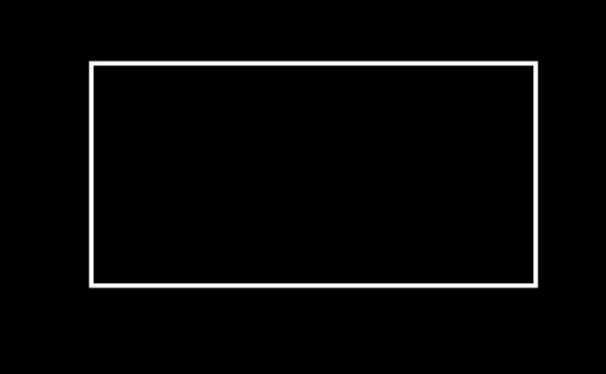

## TODO

- [x] `def reset_points(self)`：介绍`points`属性。
- [x] `def generate_target`：做一个动画。
- [ ] `self.submobjects`：有什么作用？
- [ ] `Triangle`在`shift`等变换之后，解决顶点坐标不会更新的问题。
- [ ] `add_updater()`：做一个动画。
- [ ] `self.apply_points_function_about_point`原理，`self.points`的作用。
- [ ] `rotate`旋转的不同。
- [ ] `self.flip()`的细节。

## 目录

* [前言](#前言)

* [Mobject类](#Mobject类)
  * [CONFIG属性](#CONFIG属性)
  * [相关函数](#相关函数)

* [VMobject类](#VMobject类)


## 前言

`Mobject`是用数学描述的对象，是屏幕中出现的所有物体的基类。

---

## `Mobject`类

>class `manimlib.mobject.mobject.Mobject(**kwargs)`

### `CONFIG`属性

```python
"color": WHITE,	# 默认颜色为
"name": None,	# 对象的名称
"dim": 3,		# 维度
"target": None,	# 自身对象
"plot_depth": 0,# 图层，高的的图层会覆盖低的图层
```

### 相关函数

#### `def __init__(self, **kwargs)`

> 功能

初始化`Mobject`对象。

#### `def set_plot_depth(self, plot_depth_value)`

> 功能

设置对象的图层优先级，越高表示图层越在上面。

> parameters

`plot_depth_value`：图层数值，默认为0

#### `def get_plot_depth(self)`

> return

该对象的图层数值。

#### `def set_plot_depth_by_z(self)`

>功能

根据物体的`z`坐标设置图层优先级。

#### `def __str__(self)`

> return

该对象的`name`属性。

> example

```python
rec = Rectangle()
print(rec.__str__())
>>>Rectangle
```

#### `def reset_points(self)`

> 功能

重置对象的`points`属性，变为0*3的维度。

`Mobject`在屏幕上显示出来是依靠贝塞尔曲线实现的，这就涉及到锚点和控制点，`points`储存着锚点和控制点的坐标。默认一条线段上要有**四个点**。

```python
rec = Rectangle()
print(rec.points)
np.array([[-2,1,0],[-0.666667,1,0],......])
```

#### `def init_colors(self)`

`pass`，在子类中实现。

#### `def generate_points(self)`

`pass`，在子类中实现。

#### `def add(self, *mobjects)`

> 功能

将`mobjects`添加进该对象的`submobjects`属性，也就是子对象。

> parameters

`mobjects`：除去本身以外的`Mobject`对象。

#### `def add_to_back(self, *mobjects)`

> 功能

跟`add()`函数差不多，具体差别看源码。

#### `def remove(self, *mobjects)`

> 功能

在`self.submobjects`中去除与`mobjects`相同的对象。

#### `def get_array_attrs(self)`

> return

`['points']`，这个有啥用啊？作者的意思应该是获取对象所有的属性列表。所以改之后的代码如下：

```python
def get_array_attrs(self):
    # return ["points"]
    return self.__dict__.keys()
```

#### `def digest_mobject_attrs(self)`

> 功能

`Ensures all attributes which are mobjects are included in the submobjects list.`

还不清楚这个有啥用。

将子对象的属性加入`subobjects`干嘛？

#### `def apply_over_attr_arrays(self, func)`

> 功能

利用`func`函数修改对象的属性值。

> parameters

* `func`：function，函数一次接收一个属性值修改之后返回，覆盖掉原来的属性值。

> example

```python
rec = Rectangle()
print(rec.__dict__)		# 打印rec对象的所有属性
>>>'color': <Color white>, 'name': 'Rectangle', 'dim': 3, 'target': None,......
# 设置修改函数
def func(attr):
    return 1		# 也就是将rec的所有属性设置为1，现实用法肯定不对
rec.apply_over_arrays(func)
print(rec.__dict__)
>>>'color': 1, 'name': 1, 'dim': 1, 'target': 1,......
```

当然，这个`func`并不是我们想要设置的，只是为了方便说明整个函数是怎么运行的。

#### `def get_image(self, camera=None)`

> return

`<class 'PIL.Image.Image'>`

这里调用了`Camera`获取屏幕的所有对象，利用`PIL`生成图片之后返回。

> parameters

`camera`：摄像头对象，在`Scene`中默认存在。

#### `def show(self, camera=None)`

> 功能

获取所有的对象生成图片展示出来。

> parameters

`camera`：摄像头对象。

> example

```python
class Bezier_Test(Scene):
    def construct(self):
        rec = Rectangle()
        rec.show(self.camera)
```

输出结果：注意这个函数不会保存图片，只是**展示**，后面会讲到是哪里调用了这个函数。



#### `def save_image(self, name=None)`

> 功能

调用前面的`get_image()`获取图片之后保存，设置的路径为：`os.path.join(consts.VIDEO_DIR, (name or str(self)) + ".png")`

> parameters

`name`：图片的名称。

#### `def copy(self)`

> 功能

浅拷贝，生成新的对象（怎么感觉和深拷贝一样）。

#### `def deepcopy(self)`

> 功能

深度复制自身对象。

#### `def generate_target(self, use_deepcopy=False)`

> 功能

通过复制自己生成自己的`self.target`属性。

> parameters

`use_deepcopy`：是否使用深拷贝。

> example

[MoveToTarget](https://elteoremadebeethoven.github.io/manim_3feb_docs.github.io/html/tree/animations/transform.html)

#### `def update(self, dt=0, recursive=True)`

> 功能

更新自身对象，做复杂动画的基础。

`self.updaters`里面包含了用于更新对象状态的函数，等于每过`dt`时间就将对象传入`updater`中更新状态，进而生成动画。

> parameters

`dt`：时间间隔，默认为0，也就是对象不会变化。

`recursive`：循环更新子对象的状态。

#### `def get_time_based_updaters(self)`

> return

返回包含`dt`为基础变化的`updater`列表。

#### `def has_time_based_updater(self)`

> 功能

如果`self.updaters`包含以`dt`为基础的变化函数，返回`True`，否则返回`False`。

#### `def get_updaters(self)`

> return

返回`self.updaters`。

#### `def get_family_updaters(self)`

> return

返回所有对象的`self.updaters`列表，也包括自身。

#### `def add_updater(self, update_function, index=None, call_updater=True)`

> 功能

向`self.updaters`添加`update_function`。

> parameters

`update_function`：状态更新函数，能够实时改变对象的状态的函数。

`index`：`self.updaters`列表的索引，负责插入什么位置。

`call_updater`：作用应该是不让`update`在`add_updater`的时候就运行吧。

> example


#### `def remove_updater(self, update_function)`

> 功能

在`self.updaters`中去除`update_funcitioin`。

> parameters

`update_function`：要去除的`update`函数。

#### `def clear_updaters(self, recursive=True)`

> 功能

清除对象所有的`self.updaters`

> parameters

`recursive`：迭代标志，是否清除子对象的`updaters`。

#### `def match_updaters(self, mobject)`

> 功能

将`mobject`的`updaters`匹配到自身。

> parameters

`mobject`：匹配的对象。

#### `def suspend_updating(self, recursive=True)`

> 功能

暂停所有的`update`，可以这么理解吧？

> parameters

`recursive`：迭代标志，是否进入子对象迭代函数。

#### `def resume_updating(self, recursive=True)`

> 功能

重新开始`update`，例子很少，还不清楚怎么用。

#### `def apply_to_family(self, func)`

> 功能

将自己包括子物体应用于`func`。

> parameters

`func`：目标函数。

#### `def shift(self, *vectors)`

> 功能

平移。

> parameters

`vectors`：向量组。

#### `def scale(self, scale_factor, **kwargs)`

> 功能

缩放。

> parameters

`scale_factor`：缩放因子。

#### `def rotate_about_origin(self, angle, axis=OUT, axes=[])`

> 功能

根据原点坐标旋转。

> parameters

`angle`：旋转角度。

`axis`：旋转轴，`OUT`表示从屏幕向外，右手定则。

`axes`：轴方向，跟`numpy`数组有关，有兴趣自己研究。

#### `def rotate(self, angle, axis=OUT, **kwargs)`

> 功能

根据指定位置旋转。

> parameters

`angle`：旋转角度。

`axis`：旋转轴方向。

`**kwargs`：可以包含`about_point`参数。

#### `def flip(self, axis=UP, **kwargs)`

> 功能

翻转。

> parameters

`axis`：旋转轴。

#### `def stretch(self, factor, dim, **kwargs)`

> 功能


---

## `VMobjct`类


---

## `PMobject`类


---

## `SVGMobject`类


---

## `ValueTracker`类


## 文字类


